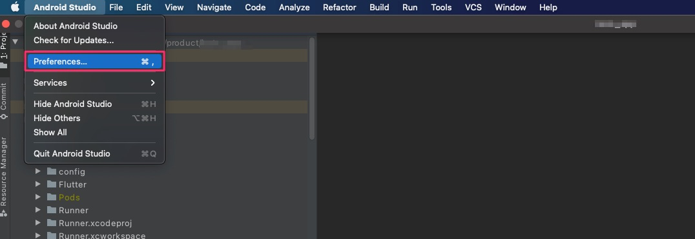
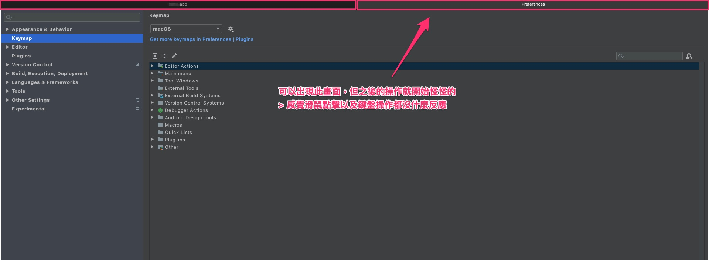
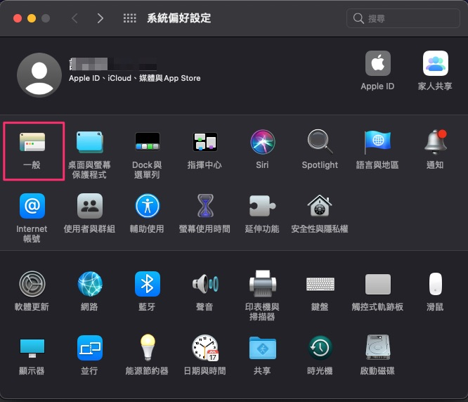
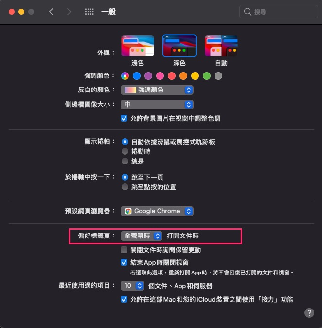
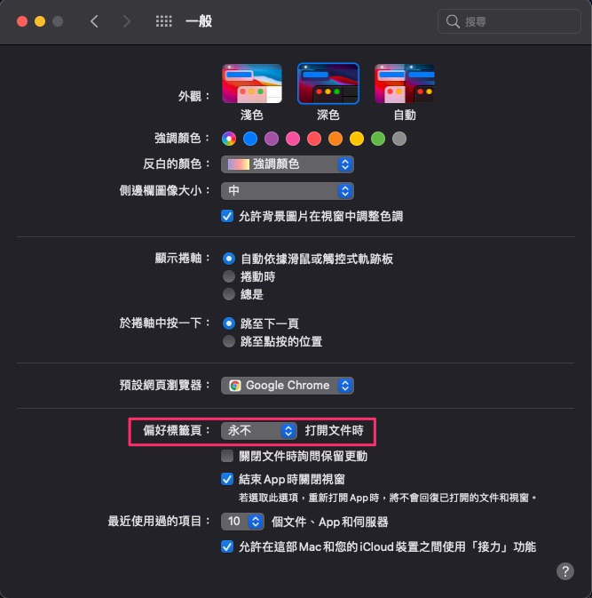

# Android Studio Freezing Problem in FullScreen at MacOS BigSur

- 環境 : MacOS BigSur

- 問題 :

  於 MacOS BigSur，使用Android Studio 開啟 FullScreen 模式，

  在一些操作時，如開啟等，很容易遇到程式卡住或不順怪怪的情況。

---

## 大綱

- [Android Studio Freezing Problem in FullScreen at MacOS BigSur](#android-studio-freezing-problem-in-fullscreen-at-macos-bigsur)
  - [大綱](#大綱)
  - [概要說明](#概要說明)
  - [解決方式](#解決方式)
    - [方式一 (Mac OS 的 Preference 設定調整)](#方式一-mac-os-的-preference-設定調整)
    - [方式二 (CommandLine 設定)](#方式二-commandline-設定)
  - [結論](#結論)
  - [參考](#參考)

---

## 概要說明

我常遇到卡住問題，其中一個再現方式為

- 開啟 Android Studio 的設定

  

- 出現設定後的畫面描述

  

  此時操作就開始怪怪的了，有時需要用強制關閉程式比較快可以解除此狀況。

---

## 解決方式

找尋文章，主要有兩個解決方式。

### 方式一 (Mac OS 的 Preference 設定調整)

- 開啟 OS 的 [設定] [一般]

  > System Preferences > General.

  

- 點擊[偏好標籤頁][打開文件]的選項

  > In the Prefer tabs when opening documents option.

  

- 選擇[永不]

  > select "never".

  

- 附註 :

  當下設定即可生效，修改完後，操作 Android Studio 的設定也可以正常運行。

### 方式二 (CommandLine 設定)

於 Terminal 輸入下列指令。

- commandline

  ```sh
    defaults write com.google.android.studio AppleWindowTabbingMode manual
  ```

- 注意事項 :

  需於設定後再開啟 Android Studio，否則可能會是原先開啟 Android Studio 當下的設定狀態。

---

## 結論

實測結果，方式二需要設定後再開啟 Android Studio 即可達到同樣效果。

目前我是使用方式二，可針對單一 App 來設定，不影響原來的 Mac OS [設定][一般] 的設定值。

---

## 參考

- [Android Studio 4.1.1- MacOS BigSur - Freezing Problem in FullScreen - Stack Overflow](https://stackoverflow.com/questions/64952961/android-studio-4-1-1-macos-bigsur-freezing-problem-in-fullscreen)

---

[=> Top](#android-studio-freezing-problem-in-fullscreen-at-macos-bigsur)

[=> Go Back](../README.md)
