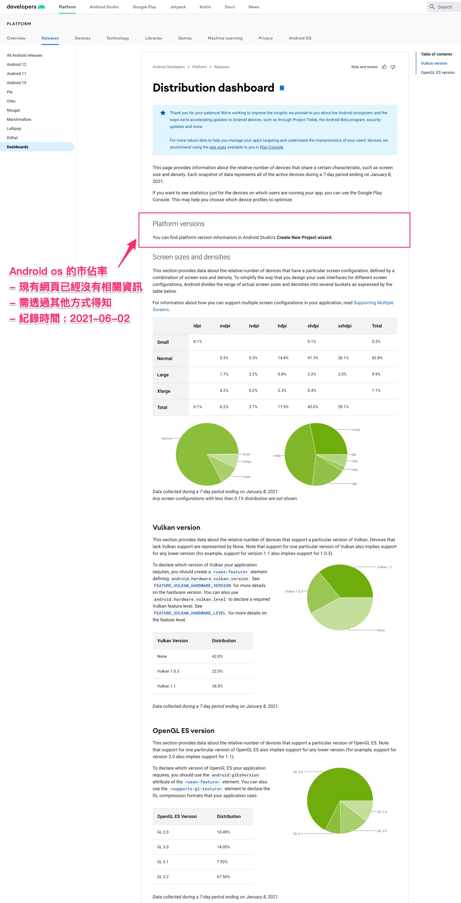
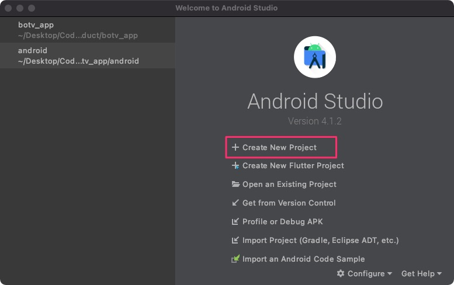
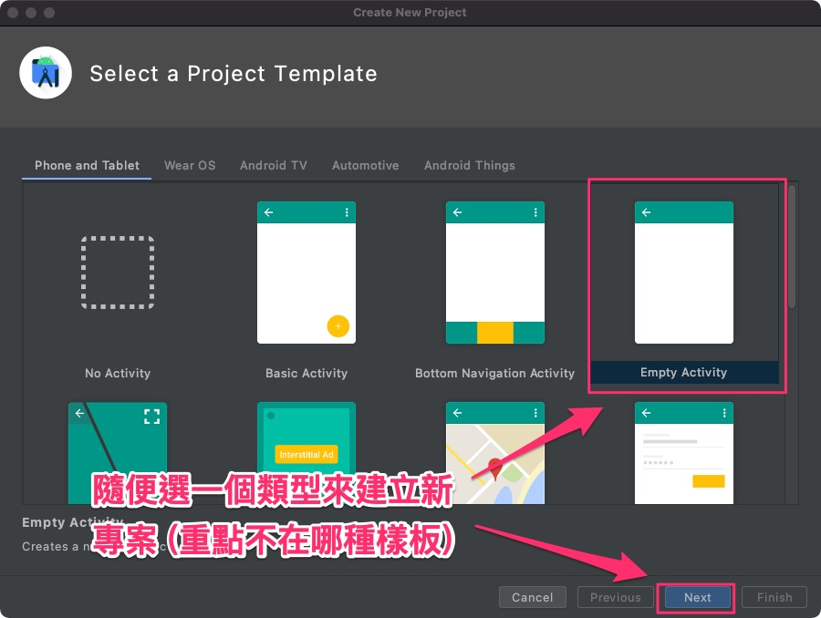
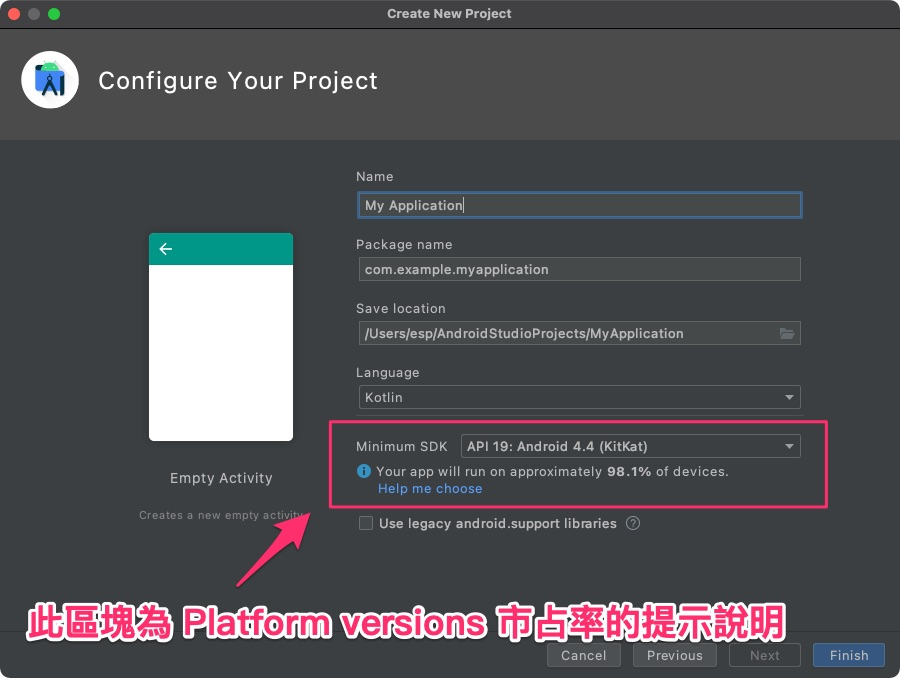
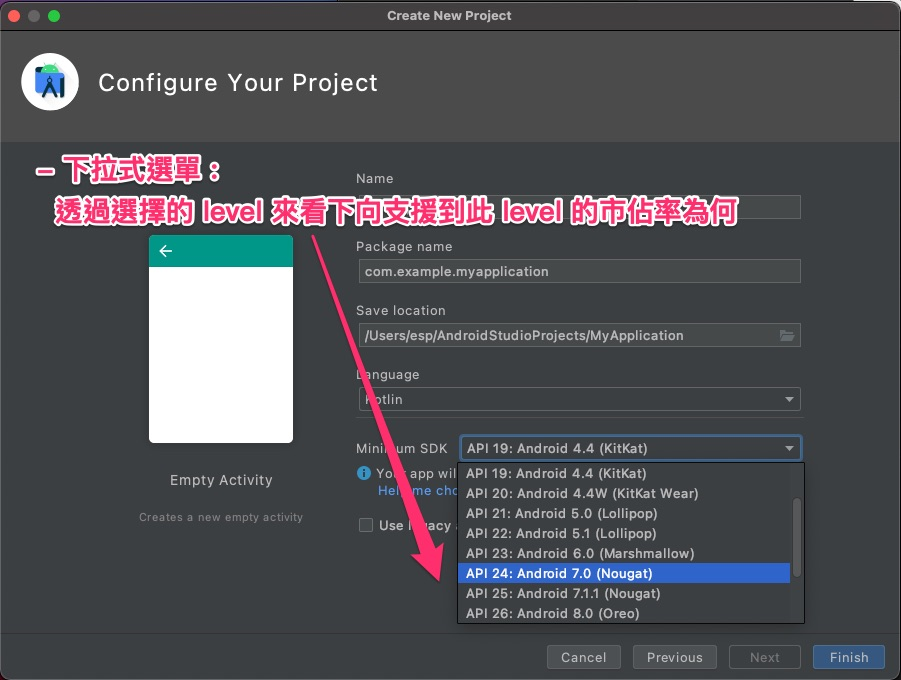
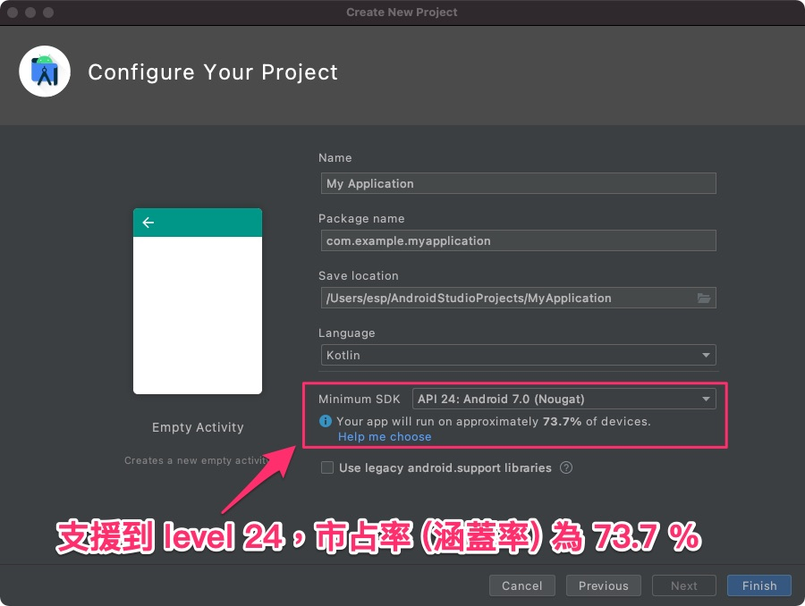
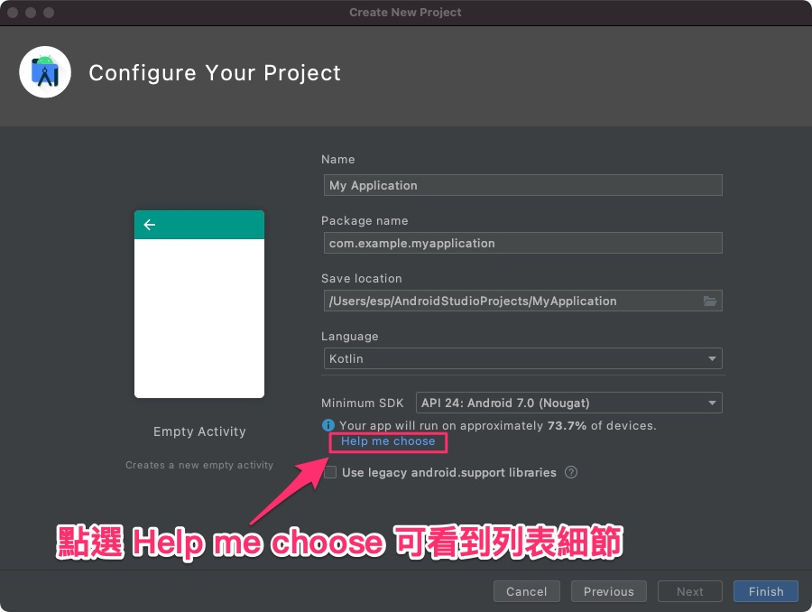
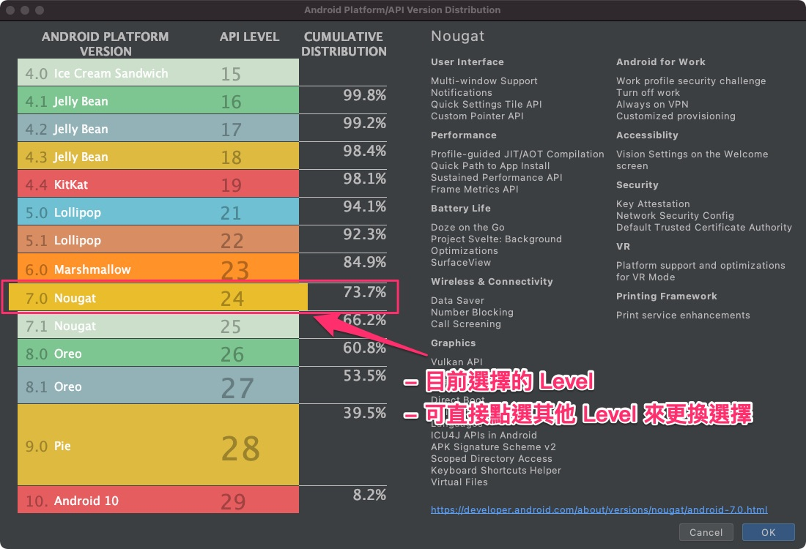

# Market Share

---

## 大綱

- [Market Share](#market-share)
  - [大綱](#大綱)
  - [說明](#說明)
  - [探討](#探討)
  - [Cumulative Distribution](#cumulative-distribution)
  - [參考](#參考)

---

## 說明

- 撰寫時間 : 2021-06-02

之前要知道 Android os 的市佔率，

可以透過官方的 [Distribution Dashboard][分发信息中心  |  Android 开发者  |  Android Developers] 得知訊息。

如下圖 :

官方的說明主要分幾個部分:

> 不同部分有分佈率資料的，都以收集日期 (2020 年 8 月 30 日) 往回推七天的資訊為主。

- Platform versions

  原本的 Android OS 市占率，現在移除了，只留下說明。

  > 沒有定期公布市占率資訊，而只由開發者知道資訊，可由 Android Studio 建立新專案時可以得知。
  >
  > 詳見 [Cumulative Distribution](#cumulative-distribution)

- Screen sizes and densities

  螢幕尺寸和密度的市場分佈率。

- Vulkan version

  支援 Vulkan 版本的市場分佈率。

  > 高版本街相容於低版本。

  - 說明 :

    節錄自 [Vulkan - 維基百科，自由的百科全書]。

    > Vulkan是一個低開銷、跨平台的二維、三維圖形與計算的應用程式介面（API），類似 Open GL 用途。

- OpenGL ES version

  OepnGL 版本的市場分佈率。

  - 說明 :

    節錄自 [OpenGL ES - 維基百科，自由的百科全書]。

    > OpenGL ES（OpenGL for Embedded Systems）是三維圖形應用程式介面OpenGL的子集，針對手機、PDA和遊戲主機等嵌入式裝置而設計。

---

## 探討

Platform versions 已經沒有在官方網站上面公開說明了，

覺得這件事情頗為奇妙，找一下相關文章。

有找到 [Google 不再對外公布，Android 版本分布數據只有開發者知道] 這篇說明，

內文大概是說明在官網只說到提供給開發者知道資訊，

其餘是推測為何沒有想要定期 (不定期) 公布，有興趣者可以參考看看。

---

## Cumulative Distribution

現在來說明如何使用 Android Studio 來了解原本的 platform versions 的市佔率。

以下以步驟方式來說明 :

- Create Project

  透過 Android Studio 建立新專案。

  

- Choose any project templete to create

  任意選擇一個樣本專案。

  

- Minimum Android Platform Vesion (Level) Cumulative Distribution

  目前選擇最低版本的 Android Level 以及對應的市佔率說明區塊。

  

- Choose Another Android Platform Vesion (Level)

  可以使用下拉式選單，切斷不同的 Level。

  

- Check level 24 Cumulative Distribution

  可以看到 level 24 的市佔率。

  

- Click `Help me choose` Button

  另一個選擇 Level 的方式，有提供比較多的細節，方便選擇。

  

- Click `Help me choose` Button

  會另開視窗，如下圖，所有的 Level 以及對應的累積市占率皆會呈現出來，
  
  點選要的之後，按下 OK 則可設定此次選擇的 Level。

  

  - Cumulative Distribution (累積分布)

    概念為選擇的 level 為最低支援，

    數值表示 包含此 level 以上的市佔率 (涵蓋率) 為何。

    > e.g. Level 24 : 73.7% 表示 涵蓋 Level 24 ~ Level 29 的市佔率。
    >
    > 該數值是由下而上的累積。

  - Level 20 issue

    不知為何，該列表並沒有 level 20 的選項，

    會是 level 20 其實並沒有 release 到市場上還是其他因素？

    目前尚不清楚緣由。

---

## 參考

- [分发信息中心  |  Android 开发者  |  Android Developers]

- [Vulkan - 維基百科，自由的百科全書]

- [OpenGL ES - 維基百科，自由的百科全書]

- [Google 不再對外公布，Android 版本分布數據只有開發者知道]

<!-- 連結設定 -->

[分发信息中心  |  Android 开发者  |  Android Developers]: https://developer.android.com/about/dashboards/

[Vulkan - 維基百科，自由的百科全書]: https://zh.wikipedia.org/wiki/Vulkan

[OpenGL ES - 維基百科，自由的百科全書]: https://zh.wikipedia.org/wiki/OpenGL_ES

[Google 不再對外公布，Android 版本分布數據只有開發者知道]: https://m.eprice.com.tw/smartos/talk/124/5507337/1/

---

[=> Top](#market-share)

[=> Go Back](../README.md)
