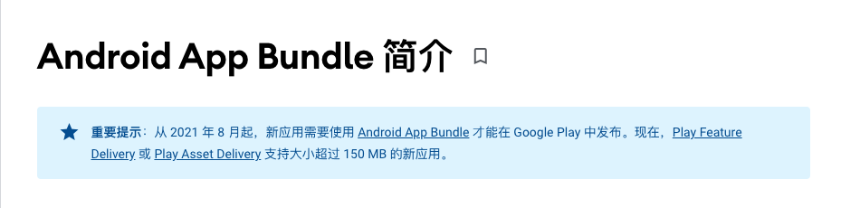

# Android App Bundle

---

## 大綱

- [Android App Bundle](#android-app-bundle)
  - [大綱](#大綱)
  - [說明](#說明)
  - [參考](#參考)

---

## 說明

**概述 :**

Android App Bundle 是一種發布格式，其中包含 App 所有經過編譯的代碼跟資源，他會將 APK 生成及簽名交由 Google Play 完成。

**簡單的流程 :**

- 編譯產出 xxx.abb

- 上傳到 Google Play Console 對應專案

- 發布後，使用者在下載時，會由 Google Play 針對使用者的裝置，動態產生該裝置需要的內容的 apk，再進行安裝。

**重要資訊 :**

於 2021 年 08 月起，新的應用 App 需要使用 Android App BUndle 才能在 Google Play 發布。

---

## 參考

- [Android App Bundle 简介  |  Android 开发者  |  Android Developers - Android App Bundle 简介]

  App Bundle 簡介，扼要說明概念，以及壓縮下載大小限制說明等。

- [Android Developers Blog: The future of Android App Bundles is here]

  2021-06-29 新聞，說明 2021-08 新上架的 App 應用，需要使用 Android App Bundle 上傳發布。

- [The Android App Bundle format  |  Android Developers]

  說明 App Bundle 的格式，以及如何拆分 apk 等資訊。

- [Android 开发者  |  Android Developers - Android App Bundle]

---

<!-- 參考設定 -->
[Android Developers Blog: The future of Android App Bundles is here]:
  https://android-developers.googleblog.com/2021/06/the-future-of-android-app-bundles-is.html

[The Android App Bundle format  |  Android Developers]: https://developer.android.com/guide/app-bundle/app-bundle-format

[Android 开发者  |  Android Developers - Android App Bundle]:
  https://developer.android.com/platform/technology/app-bundle

[Android App Bundle 简介  |  Android 开发者  |  Android Developers - Android App Bundle 简介]:
  https://developer.android.com/guide/app-bundle

---

[=> Top](#android-app-bundle)

[=> Go Back](../README.md)
