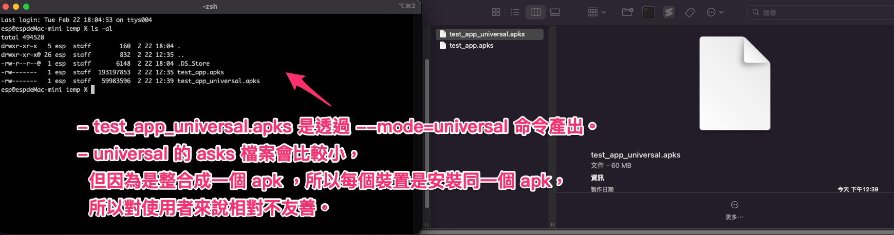
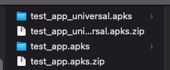
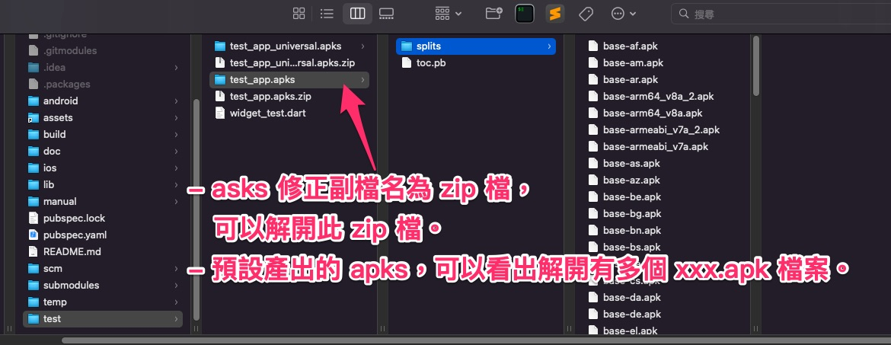
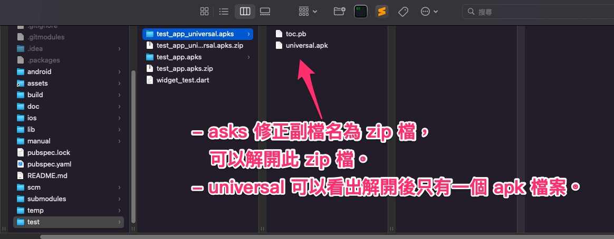
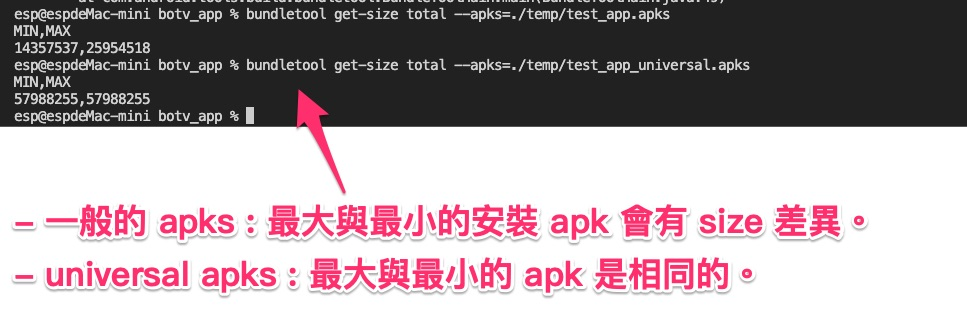

# Mode-Universal 分析

---

## 大綱

- [Mode-Universal 分析](#mode-universal-分析)
  - [大綱](#大綱)
  - [說明](#說明)
  - [分析](#分析)
  - [參考](#參考)

---

## 說明

bundletool build-apks 的參數中，有個特別的設定為 `--mode=universal` ，

在此作一下實驗，來驗證以及理解官方的說明為何。

---

## 分析

透過命令分別產出 一般的 apks 以及 有設定  `--mode=universal` 的 apks，

並以此來分析差異性。

- 產出的 apks :

  使用下列的 command line 產出兩種不同的 apks。

  

- 01 : 產出的 apks

  

  - 預設命令產出的 apks (一般的 apks) :

    - command line sample:

      ```sh
      bundletool build-apks --bundle=[aab file path]/[aab file name].aab --output=[output file path]/[output apks name].apks --ks=[keystore file path]/[keystore file name].keystore --ks-pass=pass:[keystore passwork] --ks-key-alias=[key alias name] --key-pass=pass:[key passwork]
      ```

    - name : test_app.apks

    - size : 193197853 (約 193.2 MB)

  - 使用 mode=universal 產出的 apks :

    - command line sample:

      ```sh
      bundletool build-apks --bundle=[aab file path]/[aab file name].aab --output=[output file path]/[output apks name].apks --ks=[keystore file path]/[keystore file name].keystore --ks-pass=pass:[keystore passwork] --ks-key-alias=[key alias name] --key-pass=pass:[key passwork] --mode=universal
      ```

    - name : test_app_universal.apks

    - size : 59983596 (約 60 MB)

- 02 : apks 可修正副檔名 為 zip 檔

  

  產出的 [xxx].apks 無法透過 Android Studio 來分析，

  不過 [xxx].apks 本身也是一個 zip 檔，

  所以可以透過修正副檔名為 zip， 再解開之。

- 03 : 預設命令產出的 apks (一般的 apks) 解壓縮後的內容 :

  

  可看出裡面有多個 xxx.apk。

  依官方的介紹，會依據裝置來動態產出合適的 apk，

  再進行安裝。

  apks 雖然會較大，但安裝到裝置時，會最小化 apk 來安裝，

  所以對使用者會較友善。

- 04 : universal apks 解壓縮後的內容 :

  

  可看出 universal 解開來的 apk 只有一個，不分平台，所有的裝置會安裝同一份。

  > 效果類似直接上傳單一 apk 到 Google Play 上。

- 05 : get-size 命令分析最大及最小的容量大小 :

  

  bundletool 透過 `get-size` 參數，來分析，該 apks 安裝到裝置時，

  最大以及最小的容量分析。

  - command line :

    ```sh
    bundletool get-size total --apks=[apks file name].apks
    ```

  - 預設命令產出的 apks (一般的 apks) :

    最大及最小會不同。

  - universal apks :

    最大及最小都相同。

---

## 參考

- [bundletool  |  Android 开发者  |  Android Developers]

  官方說明。

---

<!-- 連結設定 -->

[bundletool  |  Android 开发者  |  Android Developers]:
  [bundletool](https://developer.android.com/studio/command-line/bundletool#generate_apks)

[=> Top](#mode-universal-分析)

[=> Go Back](../README.md)
