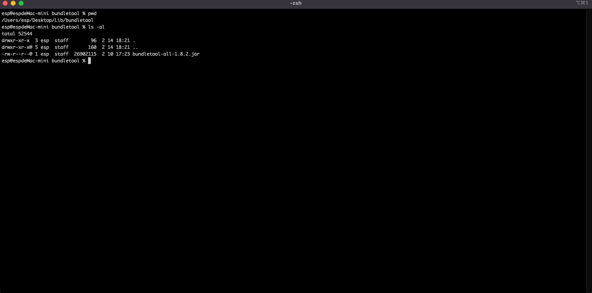
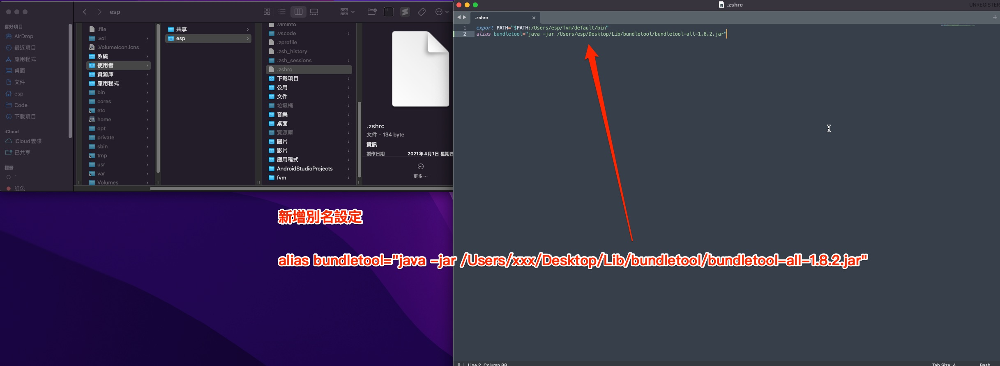
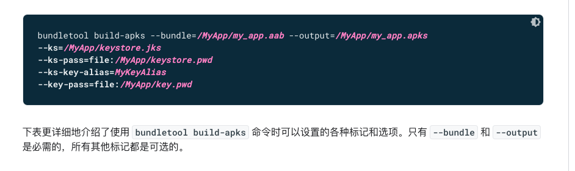
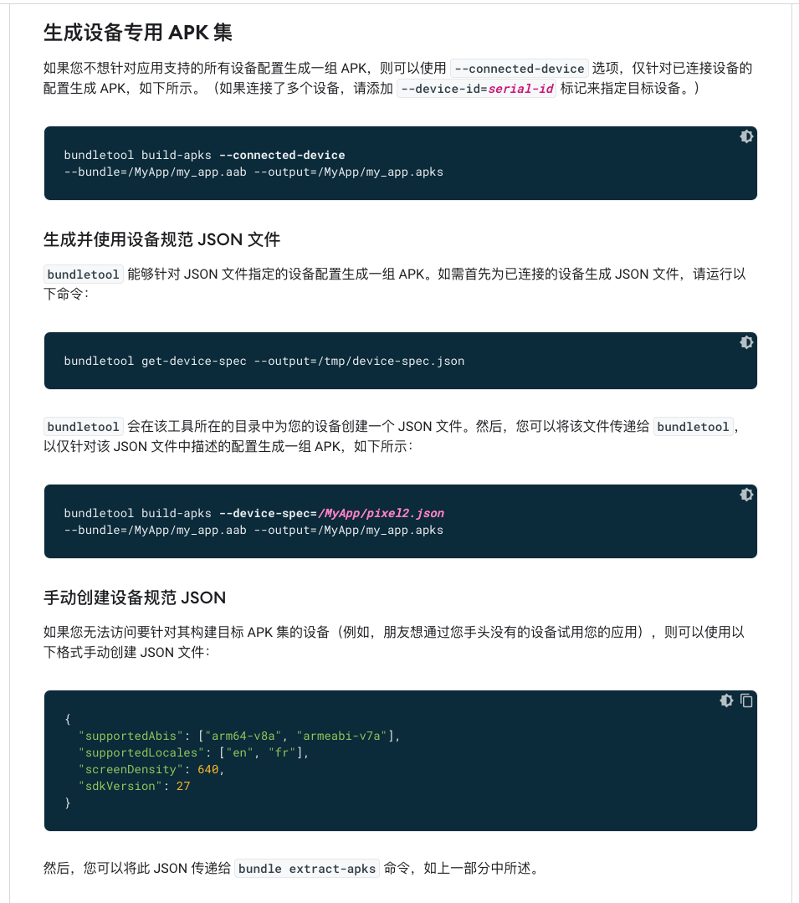

# bundletool

---
---

## 大綱

- [bundletool](#bundletool)
  - [大綱](#大綱)
  - [概述](#概述)
  - [環境設置](#環境設置)
    - [下載 bundletool](#下載-bundletool)
    - [bundletool 格式說明](#bundletool-格式說明)
    - [命名別名配置](#命名別名配置)
  - [參數介紹](#參數介紹)
    - [aab to apks](#aab-to-apks)
    - [install to apk](#install-to-apk)
    - [apks analysis](#apks-analysis)
  - [延伸閱讀](#延伸閱讀)
  - [參考](#參考)

---
---

## 概述

摘錄自[官網][bundletool  |  Android 开发者  |  Android Developers] :

bundletool 是一種底層工具，

可供 Android Studio、Android Gradle 插件和 Google Play 用於構建 Android App Bundle 文件並將 app bundle 轉換為部署到設備的各種 APK。

您也可以將 bundletool 作為一種命令行工具，

用於自行構建 app bundle 和重新創建應用 APK 的 Google Play 服務器端 build。

> 以下的說明，為實測時的一些環境安裝說明，還有略微整理及介紹一些參數用法，
>
> 細節可看下面的 [參考](#參考)。

---
---

## 環境設置

### 下載 bundletool

可自 [GitHub bundletool Release][Releases · google/bundletool · GitHub] 下載。

---

### bundletool 格式說明

由於 bundletool 工具為一個 .jar 格式文件。

所以運行環境需要先配置 jaba 環境。

可使用 java -jar bundletool-xxx.jar 來使用。

---

### 命名別名配置

另外，可使用腳本並配置環境變量，方便全局使用。

可參考 [bundletool 工具使用 - 簡書] 文章中，關於命令別平配置的方式。


**bundletool alais for mac :**

這邊介紹 mac 的設定使用方式。

> windows 我沒有實驗，但應該也是可行的。

- 01 : 下載的 bundletool-xxx.jar 放到想要設定的資料夾中。

  

- 02 : 測試 java -jar bundletool-xxx.jar

  確定可以使用該 bundletool-xxx.jar 工具。

  

- 03 : mac 開啟 .bash_profile 或 .zshrc 檔案。

  開啟 mac 的環境設定檔案，於 macOS 10.6 之後，Apple 改使用 zsh shell 當期預設的 shell。

  

- 04 : 新增別名的設定 (for .bash_profile or .zshrc)

  可設定如下 :

  以下為範例，可視個別需求，設定到合適的位置。

  ```shell
  alias bundletool="java -jar /Users/xxx/Desktop/Lib/bundletool/bundletool-all-1.8.2.jar"
  ```

  

- 05 : 在 terminal 使環境變數立即生效。

  可使用 source .bash_profile or .zshrc ，使環境變數立即生效。

  

- 06 : 驗證 alias

  

---
---

## 參數介紹

### aab to apks

- bundletool `build-apks`

  基本的 `build-apks` 使用方式。

  > 下面會在介紹額外的 param，會有不同的效果。

  - 官方介紹 :

    

  - 官方範例 :

  ```sh

    bundletool build-apks --bundle=/MyApp/my_app.aab --output=/MyApp/my_app.apks
    --ks=/MyApp/keystore.jks
    --ks-pass=file:/MyApp/keystore.pwd
    --ks-key-alias=MyKeyAlias
    --key-pass=file:/MyApp/key.pwd

  ```

  這邊有個插曲，若直接輸入密碼的話，則參數要改帶入 `pass:xxx` 。

  - 錯誤的範本

    

  - 修正後執行成功

    

- bundletool `build-apks` --mode=universal

  可編譯出所有資源的 apk，亦即產出的 apks，解開後只有單一一個 apk 版本。

  - 官方介紹 :

    

  - 官方範例 :

    ```sh
      --mode=universal
    ```

- 生成設備專用 APK 集

  有幾種方式，可以產生特定裝置的 apks。

  簡單介紹如下，細節可看官網。

  - 官方介紹 :

    

  - bundletool `build-apks` --connected-device

    若只想針對連結的裝置來產生 apks，可透過 --connected-device 選項，來生成對應的 APK。

    - 官方範例 :

      ```sh
      bundletool build-apks --connected-device
      --bundle=/MyApp/my_app.aab --output=/MyApp/my_app.apks
      ```

  - 使用 設備規範 JSON 文件 :

    概念是先產生設備對應的 Json Spec 描述檔。

    然後再使用其他的參數命令，可輸入 Json Spec ，產出對應的 apks。

    - 產生設備描述檔

      可使用 bundletool 產生設備對應的 Josn Spec File。

      - 官方範例 :

        ```sh
        bundletool get-device-spec --output=/tmp/device-spec.json
        ```

    - bundletool `build-apks` --device-spec

      透過 aab ，以及設定的 device json spec file，產出對應裝置的 apks。

      - 官方範例 :

      ```sh
      bundletool build-apks --device-spec=/MyApp/pixel2.json
      --bundle=/MyApp/my_app.aab --output=/MyApp/my_app.apks
      ``

    - bundletool `extract-apks`

      可使用之前已經產出的 apks，以及設定的 device json spec file，

      可提取出對應設備的 apks。

    - 官方範例 :

      ```sh
      bundletool extract-apks
      --apks=/MyApp/my_existing_APK_set.apks
      --output-dir=/MyApp/my_pixel2_APK_set.apks
      --device-spec=/MyApp/bundletool/pixel2.json
      ```

---

### install to apk

透過 aab 產出來的 apks，如何安裝到裝置上呢?

可透過下列的方式安裝到裝置，來進行實際測試。

- 將 APK 部署到連結的設備

  透過上面的轉換後的 apks，再進行安裝到裝置。

  - 官方範例

    ```sh
    bundletool install-apks --apks=/MyApp/my_app.apks
    ```

  - 官方介紹

    

---

### apks analysis

- get-size total :

  可透過此命令，預估產出的 apks，安裝到裝置的最大及最小的大小。

  > 一般可用來預估 Google Play 下載 (aab to apk) 到使用者裝置時的網路流量大小。

  - 官方介紹 :

    

---
---

## 延伸閱讀

- [bundletool install-apks 命令 issue](./bundletoold_install_apks_issue/README.md)

  > 主要說明使用此 `bundletool install-apks` 遇到的問題，以及如何排除錯誤。

- [Mode-Universal 分析](./Mode_Universal_Analysis/README.md)

  > bundletool build-apks 的參數中， 測試 `--mode=universal` 此參數的效果以及分析與預設 (沒設定此參數) 的差異。

---
---

## 參考

- [bundletool  |  Android 开发者  |  Android Developers]

  官方說明。

- [Releases · google/bundletool · GitHub]

  bundletool 官方的下載位置。

- [bundletool 工具使用 - 簡書]

  > 有人分享 bundletool 的使用心得跟介紹。

---

<!-- 連結設定 -->

[bundletool  |  Android 开发者  |  Android Developers]:
  https://developer.android.com/studio/command-line/bundletool#generate_apks

[Releases · google/bundletool · GitHub]:
  https://github.com/google/bundletool/releases

[bundletool 工具使用 - 簡書]:
  https://www.jianshu.com/p/0308ddc9b2e7

---

[=> Top](#bundletool)

[=> Go Back](../README.md)
