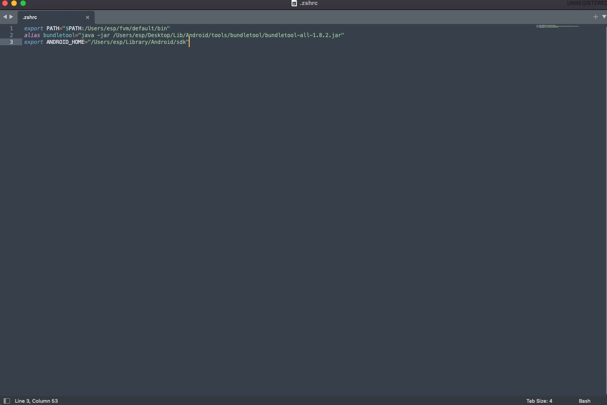

# bundletool install-apks 命令 issue

---
---

## 大綱

- [bundletool install-apks 命令 issue](#bundletool-install-apks-命令-issue)
  - [大綱](#大綱)
  - [說明](#說明)
    - [初次呼叫的錯誤](#初次呼叫的錯誤)
    - [嘗試使用 adb](#嘗試使用-adb)
    - [設定 ANDROID_HOME 環境變數](#設定-android_home-環境變數)
  - [延伸議題](#延伸議題)
  - [參考](#參考)

---
---

## 說明

主要說明使用此 `bundletool install-apks` 遇到的問題，以及如何排除錯誤。

---

### 初次呼叫的錯誤

一開始使用直接呼叫此命令。

- sample command :

  ```sh
  bundletool install-apks --apks=./temp/test_app.apks
  ```

- 實際執行命令如下 :

  ```sh
  esp@espdeMac-mini [Project_Folder] % bundletool install-apks --apks=./temp/test_app.apks
  [BT:1.8.2] Error: Unable to determine the location of ADB. Please set the --adb flag or define ANDROID_HOME or PATH environment variable.
  com.android.tools.build.bundletool.model.exceptions.CommandExecutionException: Unable to determine the location of ADB. Please set the --adb flag or define ANDROID_HOME or PATH environment variable.
          at com.android.tools.build.bundletool.model.exceptions.InternalExceptionBuilder.build(InternalExceptionBuilder.java:57)
          at com.android.tools.build.bundletool.commands.CommandUtils.lambda$null$0(CommandUtils.java:48)
          at java.base/java.util.Optional.orElseThrow(Optional.java:408)
          at com.android.tools.build.bundletool.commands.CommandUtils.lambda$getAdbPath$1(CommandUtils.java:41)
          at java.base/java.util.Optional.orElseGet(Optional.java:369)
          at com.android.tools.build.bundletool.commands.CommandUtils.getAdbPath(CommandUtils.java:37)
          at com.android.tools.build.bundletool.commands.InstallApksCommand.fromFlags(InstallApksCommand.java:147)
          at com.android.tools.build.bundletool.commands.InstallApksCommand.fromFlags(InstallApksCommand.java:141)
          at com.android.tools.build.bundletool.BundleToolMain.main(BundleToolMain.java:91)
          at com.android.tools.build.bundletool.BundleToolMain.main(BundleToolMain.java:49)
  esp@espdeMac-mini [Project_Folder] % echo $ANDROID_HOME

  ```

- 分析 :

  此時，有說明可以定義 $ANDROID_HOME 的環境變數，或者是使用 --adb 參數來動態設定 adb 的位置。

  另外有執行 `echo $ANDROID_HOME` 來驗證，確實是沒有設定 `ANDROID_HOME` 的環境變數。

---

### 嘗試使用 adb

查了一下有關 adb 應該的位置，由於我的執行環境是 mac 上安裝 Android Studio，

所以相關的 adb 路徑如下。

- Android Studio adb path:

  ```sh
  /Users/[user name]/Library/Android/sdk
  ```

- 實際執行命令如下 :

  ```sh
  esp@espdeMac-mini [Project_Folder] % bundletool install-apks --apks=./temp/test_app.apks --adb=~/Library/Android/sdk
  01:09:37 E/adb: Cannot run program "/Users/esp/Library/Android/sdk": error=13, Permission denied
  [BT:1.8.2] Error: java.io.IOException: Cannot run program "/Users/esp/Library/Android/sdk": error=13, Permission denied
  java.lang.IllegalArgumentException: java.io.IOException: Cannot run program "/Users/esp/Library/Android/sdk": error=13, Permission denied
          at com.android.ddmlib.AndroidDebugBridge.<init>(AndroidDebugBridge.java:798)
          at com.android.ddmlib.AndroidDebugBridge.createBridge(AndroidDebugBridge.java:546)
          at com.android.ddmlib.AndroidDebugBridge.createBridge(AndroidDebugBridge.java:498)
          at com.android.tools.build.bundletool.device.DdmlibAdbServer.init(DdmlibAdbServer.java:99)
          at com.android.tools.build.bundletool.commands.InstallApksCommand.execute(InstallApksCommand.java:182)
          at com.android.tools.build.bundletool.BundleToolMain.main(BundleToolMain.java:91)
          at com.android.tools.build.bundletool.BundleToolMain.main(BundleToolMain.java:49)
  Caused by: java.io.IOException: Cannot run program "/Users/esp/Library/Android/sdk": error=13, Permission denied
          at java.base/java.lang.ProcessBuilder.start(ProcessBuilder.java:1128)
          at java.base/java.lang.ProcessBuilder.start(ProcessBuilder.java:1071)
          at com.android.ddmlib.AndroidDebugBridge.lambda$runAdb$0(AndroidDebugBridge.java:865)
          at java.base/java.lang.Thread.run(Thread.java:829)
  Caused by: java.io.IOException: error=13, Permission denied
          at java.base/java.lang.ProcessImpl.forkAndExec(Native Method)
          at java.base/java.lang.ProcessImpl.<init>(ProcessImpl.java:340)
          at java.base/java.lang.ProcessImpl.start(ProcessImpl.java:271)
          at java.base/java.lang.ProcessBuilder.start(ProcessBuilder.java:1107)
          ... 3 **more**

  ```

- 分析 :

  指定 adb 失敗，想到之前有同仁有測試過，

  與 同仁 討論後，

  了解他的處理方式是使用 設定 環境變數 ANDROID_HOME，

  接下來就先測試此方式是否可以成功。

---

### 設定 ANDROID_HOME 環境變數

- Android Studio adb 位置

  參考文章 [macos - Setting ANDROID_HOME enviromental variable on Mac OS X - Stack Overflow]

  - 路徑如下 :

    ```sh
    /Users/{YOUR_USER_NAME}/Library/Android/sdk
    ```

  - 文章解法截圖 :

    

    > 後續設定只有加入 ANDROID_HOME 到環境變數，並沒有設定到 PATH 中，測試上是 OK 的。

- 原本的環境設定

  使用的 mac 環境，該環境的設定檔位置在 `~/.zshrc`。

  未修改前的內容如下 :
  
  

- 修改後環境設定

  

- 修改後 `source ~/.zshrc` 使其直接生效。

- 實際執行命令如下 :

  ```sh
  esp@espdeMac-mini [Project_Folder] % bundletool install-apks --apks=./temp/test_app.apks
  The APKs have been extracted in the directory: /var/folders/b9/k0w7t08j1gqc8ldp17hxk4kc0000gn/T/8763914209113860080
  ```

  經過測試後，可以順利安裝了。

---
---

## 延伸議題

原先的方式是參數指定 --aab 的路徑，會出現的權限問題。

之後有空可以再了解 Android Strudio error 13 issue 或 嘗試設定完整路徑看看。

> [Android Studio error 13=permission denied in linux - Stack Overflow]

---
---

## 參考

- [在MAC OS下设置ANDROID_HOME_breakloop-CSDN博客_android_home mac]

- [macos - Setting ANDROID_HOME enviromental variable on Mac OS X - Stack Overflow]

- [Android Studio error 13=permission denied in linux - Stack Overflow]

---
---

<!-- 連結設定 -->

[在MAC OS下设置ANDROID_HOME_breakloop-CSDN博客_android_home mac]:
  https://blog.csdn.net/daihuimaozideren/article/details/79501515

[macos - Setting ANDROID_HOME enviromental variable on Mac OS X - Stack Overflow]:
  https://stackoverflow.com/questions/19986214/setting-android-home-enviromental-variable-on-mac-os-x

[Android Studio error 13=permission denied in linux - Stack Overflow]:
  https://stackoverflow.com/questions/28564677/android-studio-error-13-permission-denied-in-linux

[=> Top](#bundletool-install-apks-命令-issue)

[=> Go Back](../README.md)
