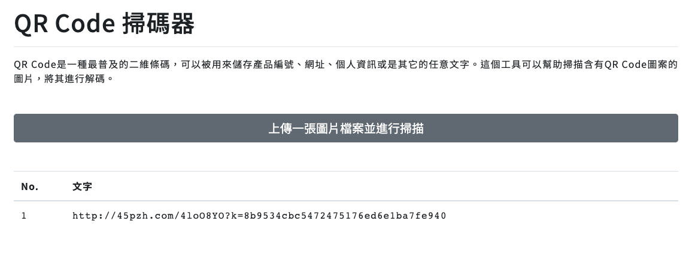
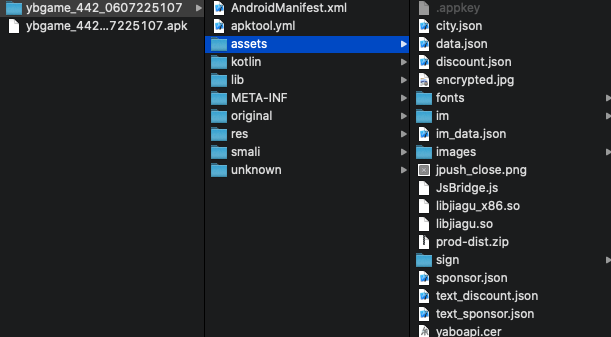
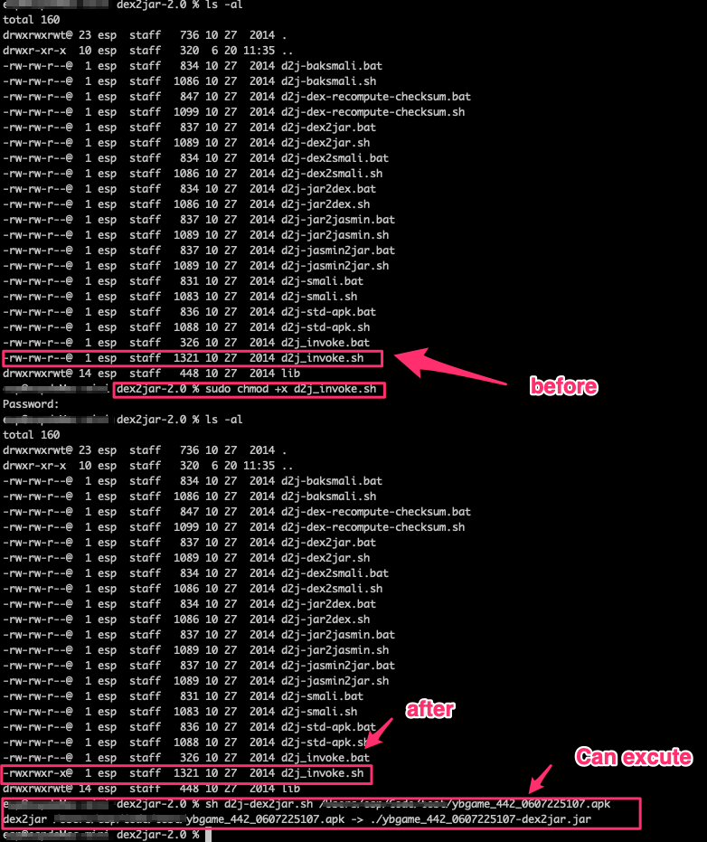
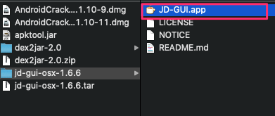
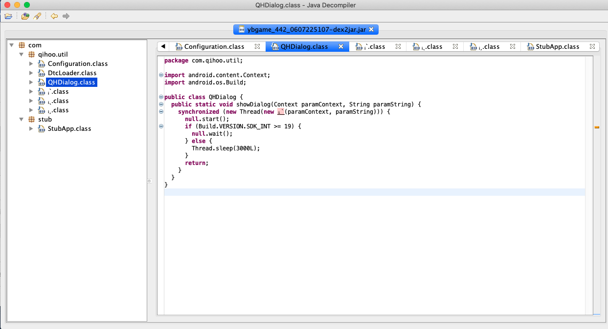
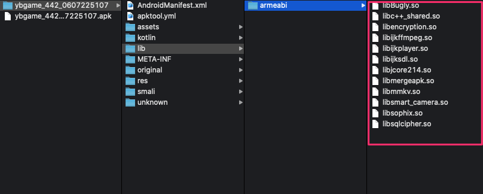
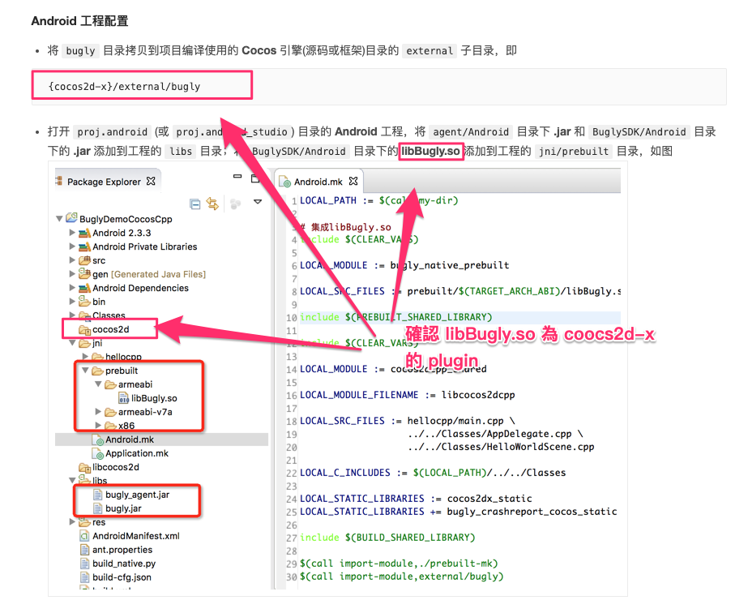

# Android crack

> 針對 Android - apk 反編譯 的相關資訊

---

## 前言

會有此篇主要是公司同仁有拿競品來，想說是否能解開來看是用什麼技術來做框架。

---

## mac 透過 chrome 的方式 下載 apk

* 下載網址
  

* chrome 開啟網頁 (透過 [QRCode 掃瞄器](https://cloud.magiclen.org/tw/qrcode/scanner) 開啟網頁)

  

* 由於該網頁也有 web 版本，所以須動點手腳才能下載 apk

* 在網頁中找到對應下載網址，並開啟 chorme 的開發者模式，改使用 android 模式

  

* 下載後的檔案為 `ybgame_442_0607225107.apk`

* 接下來要處理的是反編譯 apk

---

## 反編譯 apk

> 須透過工具解開 apk，單純解開 apk 有些資訊會看不到 (e.g. AndroidManifest.xml)

* 後來主要參考下面這篇來做反編譯流程，需要進一步研究可到[參考](#參考)看更其他深入的文章
  * [人人都會的 Android Apk 反編譯](https://blog.techbridge.cc/2016/03/24/android-decompile-introduction/)

* 主要工具
  * [apktool](https://ibotpeaches.github.io/Apktool/)
    > 解開 apk 工具，可用 homebrew 安裝
    > [安裝網頁](https://ibotpeaches.github.io/Apktool/install/)

  * [dex2jar](https://sourceforge.net/projects/dex2jar/)
    > 檢視 java code

  * [jd-gui](http://java-decompiler.github.io/)
    > apk 轉成 jar

### apktool

* 解開來的 apk 如下
  
  > 在 assets 資料夾下有看到 `libjiagu_x86.so` 及 `libjiagu.so` 為 apk 的主程式部分

### dex2jar

* dex2jar 下載的是 zip 包，內容是批次檔

* 透過 dex2jar 來將 apk 轉成 jar
  * dex2jar-2.0

  ``` shell
  sh ./d2j-dex2jar.sh [yourApk].apk
  ```

* 出現執行失敗

  ``` shell
  esp@espdeMac-mini dex2jar-2.0 % sh ./d2j-dex2jar.sh /Users/esp/Code/test/ybgame_442_0607225107.apk
  ./d2j-dex2jar.sh: line 36: ./d2j_invoke.sh: Permission denied
  ```

* 下面文章有找到是權限問題
  * [dex2jar在mac上出现permission denied解决方法 - 简书](https://www.jianshu.com/p/62dbdd67df90)

  ``` shell
  sudo chmod +x d2j_invoke.sh
  ```

* 修正完如下圖可正確執行
  
  > 此案例產出 ybgame_442_0607225107-dex2jar.jar

### jd-gui

* 透過 jd-gui 工具來開啟 ybgame_442_0607225107-dex2jar.jar

  

* 開啟如下圖
  

---

## 分析

* 資訊有點少，覺得有點奇怪，回頭看apk 解出來的內容 `assets/libjiagu.so`

* 從下面文章知道此為 360 加固的固定 檔名
  * [360加固之libjiagu.so脫殼及dex dump](https://www.itread01.com/p/1361187.html)

* 脫殼非本次重點，找無有其他方向

* 方向:引用的第三方 lib
  * 通常第三方 lib 不會包在主程式中，且也不會經過混淆，是個可能的方向
  * 路徑為 bundle/lib/xxx
  * 

* libBugly.so
  * 有找到下面文章，確認此為 `cocos2d-x` 的 plugin
  * [Cocos Plugin 使用指南 - Bugly 文档](https://bugly.qq.com/docs/user-guide/instruction-manual-plugin-cocos/?v=20200203205953)
  * 

---

## 結論

* 高度可能性是 cocos2d-x 的遊戲引擎框架

---

## 附註

### Android-Crack-Tool For Mac

* [Jermic/Android-Crack-Tool: 🐞Android crack tool For Mac](https://github.com/Jermic/Android-Crack-Tool)

一開始找到可以在 mac 反編譯 android 的工具
不過實驗時當下的 mac os 10.15.4 run 不起來

也有相關 [issue](https://github.com/Jermic/Android-Crack-Tool/issues/29)，所以暫時放棄，之後作者有更新再找時間來看．

---

## 參考

* [前言 · 安卓应用的安全和破解](https://book.crifan.com/books/android_app_security_crack/website/?q=)

* [Jermic/Android-Crack-Tool: 🐞Android crack tool For Mac](https://github.com/Jermic/Android-Crack-Tool)

* [android反编译与加固(Mac版)_zzq的博客-CSDN博客_android crack tool mac](https://blog.csdn.net/zzq272804553/article/details/64123256)

* [360加固之libjiagu.so脫殼及dex dump](https://www.itread01.com/p/1361187.html)
  > 360 脫殼流程，我尚未實際驗證．

* [人人都會的 Android Apk 反編譯](https://blog.techbridge.cc/2016/03/24/android-decompile-introduction/)

* [(Mac)反编译Android APK详细操作指南[ApkTool,dex2jar,JD-GUI]](https://www.devio.org/2018/05/08/Android-reverse-engineering-for-mac/)

* [[Mac] 反編譯 Android APK - 三阿毛 - Medium](https://medium.com/@auwit0205/mac-%E5%8F%8D%E7%B7%A8%E8%AD%AF-android-apk-839de44cc8e1)

* [Android分析破解-秒脱360加固大法](https://blog.csdn.net/qq_21051503/article/details/51322505)

* [dex2jar在mac上出现permission denied解决方法 - 简书](https://www.jianshu.com/p/62dbdd67df90)

* [Cocos Plugin 使用指南 - Bugly 文档](https://bugly.qq.com/docs/user-guide/instruction-manual-plugin-cocos/?v=20200203205953)

---

### 附檔

* 來源 [apk](./apk/ybgame_442_0607225107.apk)

---

### [回上一頁](../README.md)
