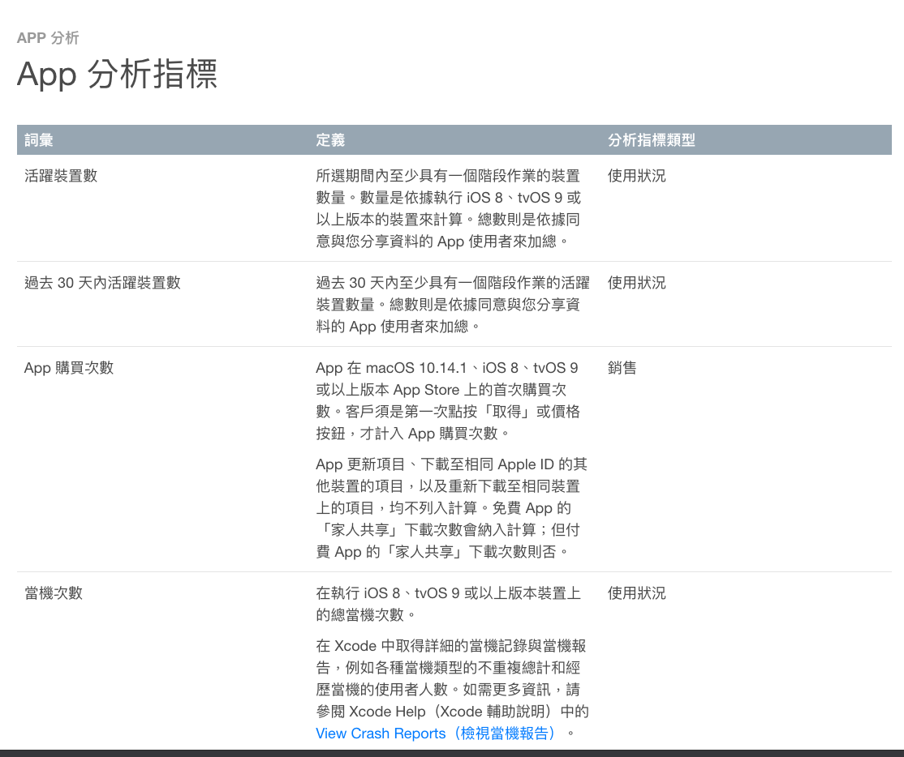

# App Store Connect

以 App Store Connect 可以使用的功能為主要說明。

---

## 大綱

- [App Store Connect](#app-store-connect)
  - [大綱](#大綱)
  - [項目](#項目)
  - [參考](#參考)

---

## 項目

- **[App Store Connect 輔助說明] :**

  App Store Connect 官方說明首頁

- [App 預覽規格 - App Store Connect 輔助說明]

  針對 App Store Connect 上面的商店資訊，

  要上傳的 App Screenshot (截圖規格) 有不懂的尺寸以及對應版本，

  可到此查閱。

- [App 內購買項目的設定流程 - App Store Connect 輔助說明]

  內購項目的設定說明。

  - [提交 App 內購買項目 - App Store Connect 輔助說明]

    這邊有特別提到第一次提交某一個類型的內購審查，

    不論是第一次的`消耗型項目`，或第一次的`自動續訂型訂閱`，

    皆需要搭配 ipa 審核。

    > 送審過後同類型的下一次品項審核，
    >
    > 原則上不需要搭配 ipa 審查，
    >
    > 不過之前有遇到一次需要，
    >
    > 那次的消耗型是第一次購買後使用轉輪方式遊玩，
    >
    > 不是之前同樣的商城列表，所以特別被提出來要看。

    

- **[App 分析指標 - App Store Connect 輔助說明] :**

  說明一些分析會用到的詞彙說明。

  

  以下說明一下之前有造成同仁混淆的名詞

  - App購買量 :

    表示你的App被首次下載的次數(iOS8或更高)。

  - 安裝總數:

    是你的App安裝在iOS8或以上設備，

    包括重新下載到同一個設備，

    同一個Apple ID下的多個設備，

    或家庭共享導致的安裝。

    > 需使用者同意資料分享，所以資訊量會較少。
    >
    > 理論上.`安裝總數`應該大於/等於 `App購買量` ，
    >
    > 但由於 `安裝總數` 總數則是依據同意與您分享資料的 App 使用者來加總。
    >
    > 所以資訊是不完整的，只能當作參考。

---

## 參考

- [App Store Connect 輔助說明]

- [App 內購買項目的設定流程 - App Store Connect 輔助說明]

- [App 預覽規格 - App Store Connect 輔助說明]

- [App 分析指標 - App Store Connect 輔助說明]

- [Apple的App Analytics統計平臺你必須知道的 - 民初思韻]

- [運營必讀：新版分析工具App Analytics需知 - 每日頭條]

---

<!-- 連結設定 -->

[App Store Connect 輔助說明]: https://help.apple.com/app-store-connect/

[App 內購買項目的設定流程 - App Store Connect 輔助說明]: https://help.apple.com/app-store-connect/#/devb57be10e7

[App 預覽規格 - App Store Connect 輔助說明]: https://help.apple.com/app-store-connect/#/dev4e413fcb8

[App 分析指標 - App Store Connect 輔助說明]: https://help.apple.com/app-store-connect/#/itc21781223f

[Apple的App Analytics統計平臺你必須知道的 - 民初思韻]: http://www.rocidea.com/one?id=30454

[運營必讀：新版分析工具App Analytics需知 - 每日頭條]: https://kknews.cc/zh-tw/tech/g89lqk8.html

[=> Top](#app-store-connect)

[=> Go Back](../README.md)
