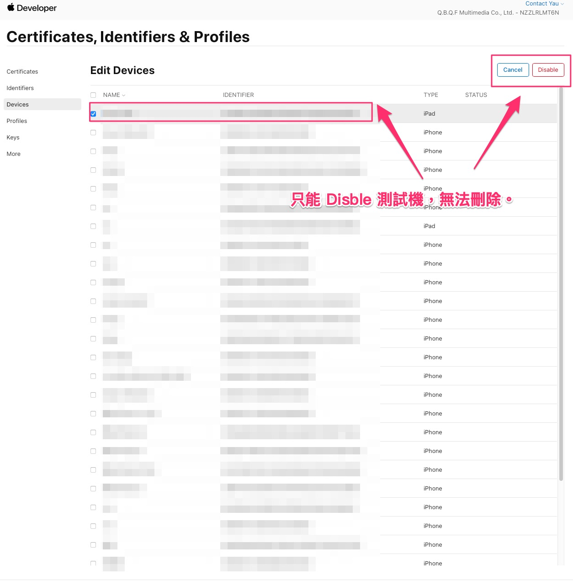
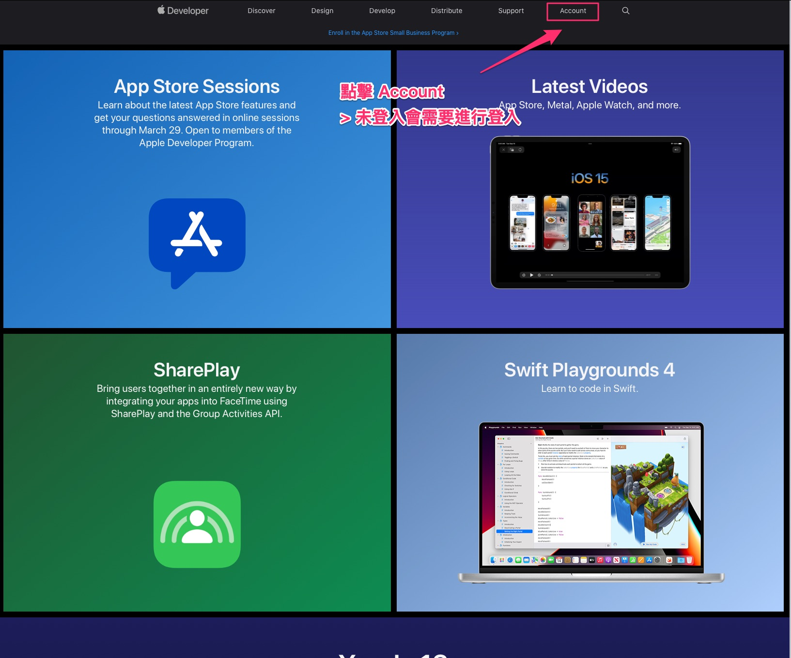
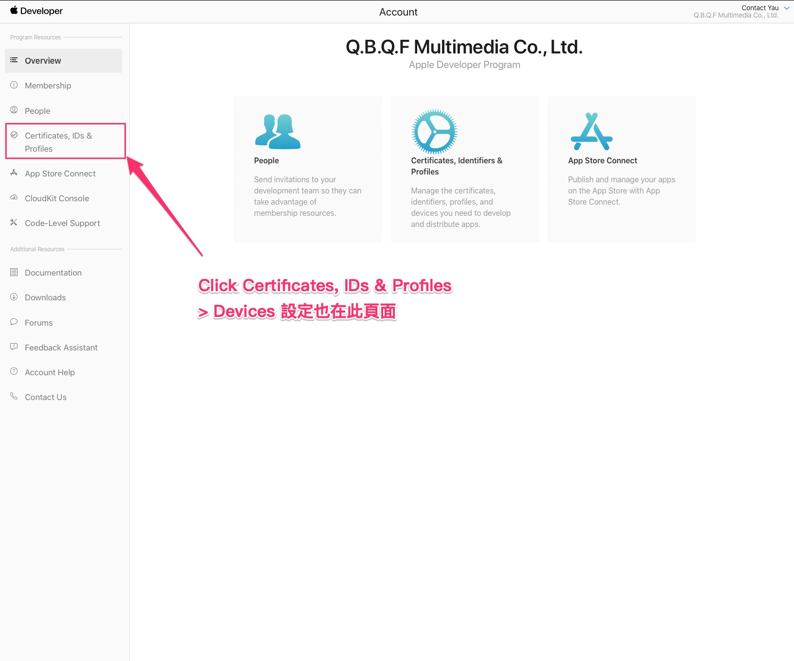
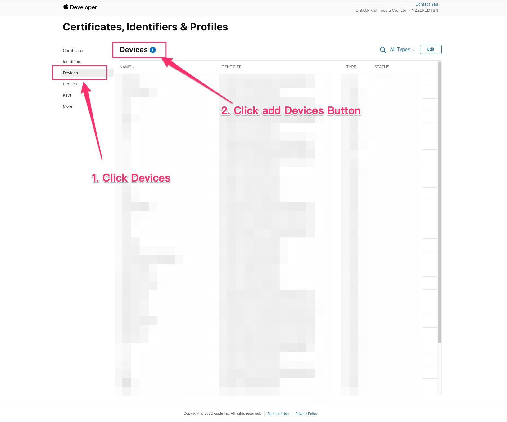
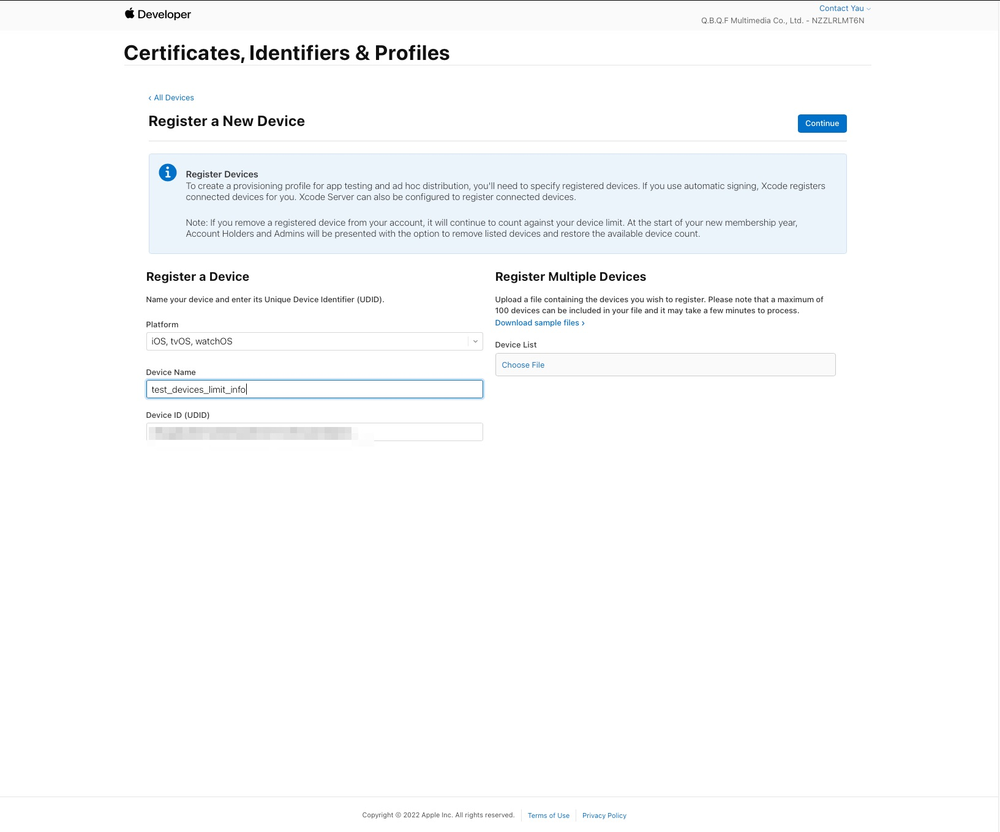
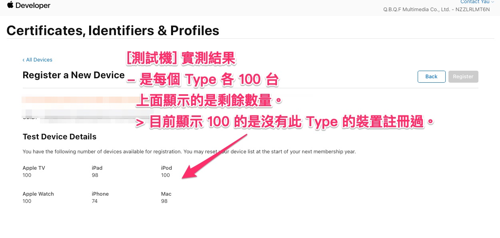

# Devices Limit

一個開發者帳號，可以使用的測試機數量上限說明。

---

## 大綱

- [Devices Limit](#devices-limit)
  - [大綱](#大綱)
  - [說明](#說明)
  - [測試機 Enable/Disable 功能](#測試機-enabledisable-功能)
  - [測試機數量 Limit](#測試機數量-limit)
  - [結論](#結論)
  - [參考](#參考)

---

## 說明

在某次討論續約時，有提到一個開發者帳號，可以每個 apple 的平台各一百台限制。

不過這是之前的印象，下面為實際上的驗證說明。

---

## 測試機 Enable/Disable 功能

已經加入測試機，無法刪除，只能設定 Disable 功能。

---

## 測試機數量 Limit

目前無法先行瀏覽還剩餘多少測試機的可用數量，

不過可以在新增測試機時，過程中某個頁面可以得知。

以下簡單說明步驟 :

- 01 : 登入 Apple Developer

  

- 02 : 進入 Certificates, IDs & Profiles 頁面

  

- 03 : 新增測試機 - 1

  

- 04 : 新增測試機 - 2

  有說明測試機註冊後，需要續約後可以 remove 一次。

  > 續約後有一次重置的機會。

  

- 05 : 新增測試機 - 3 (顯示測試機的細部資訊)

  到這一步，可看到不同 Type 對應的剩餘測試機數量。

  > 顯示 100 的，剛好是沒有註冊的 Type，由此可驗證是不同 Type 各自有 100 台數量上限。

  

---

## 結論

由上面的驗證，可得出下列的結論。

- 測試機數量上限是 by Type。

- 目前每個 Type 各一百台。

- 測試機新增後，無法刪除，消耗掉的額度無法於有效期間中再度回復。

- 續約時可重置測試機，此時可刪除不需要的測試機。

---

## 參考

- [Apple 开发者账户类型 | 闪耀旅途]

- [关于iOS测试机个数上限的详细规则_KylinBL的博客-CSDN博客]

- [iOS开发者账号与测试机个数上限 - 簡書]

---

<!-- 連結設定 -->
[Apple 开发者账户类型 | 闪耀旅途]:
  https://www.hanleylee.com/account-type-of-ios-developer.html

[关于iOS测试机个数上限的详细规则_KylinBL的博客-CSDN博客]:
  https://blog.csdn.net/kylinbl/article/details/8852462

[iOS开发者账号与测试机个数上限 - 簡書]:
  https://www.jianshu.com/p/88ca399bb0ab

[=> Top](#devices-limit)

[=> Go Back](../README.md)
