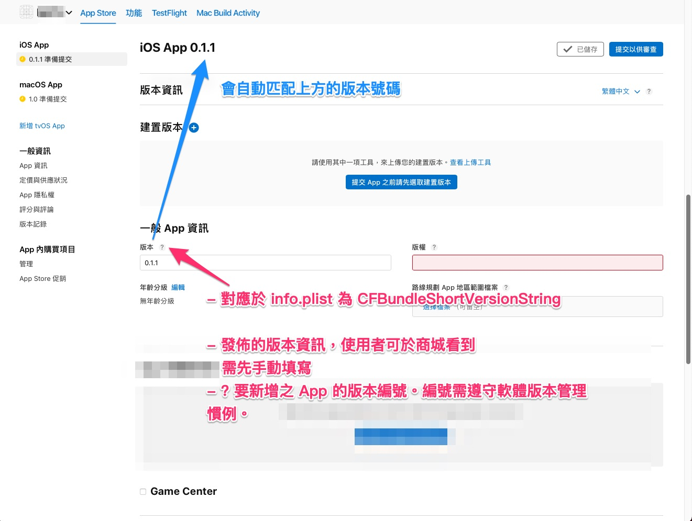
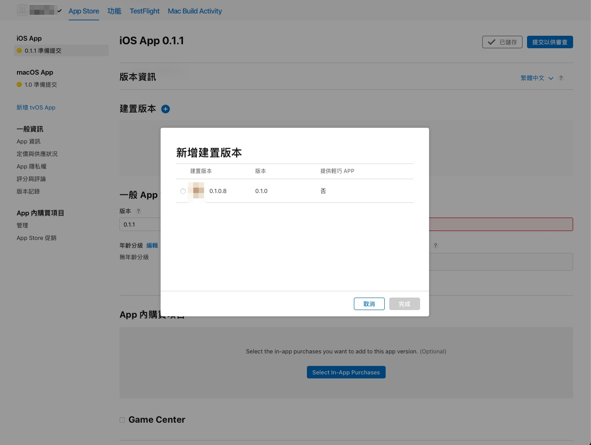
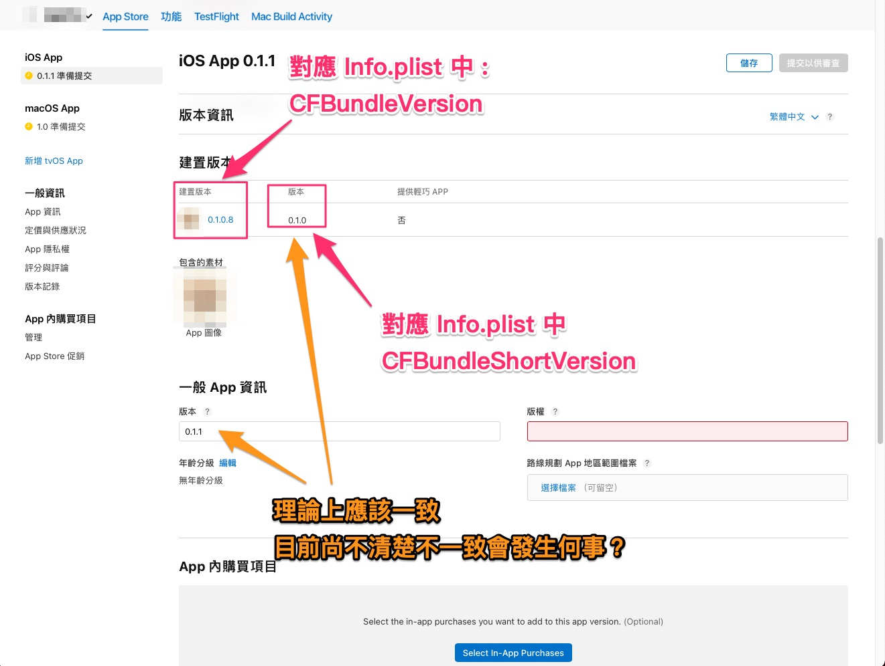
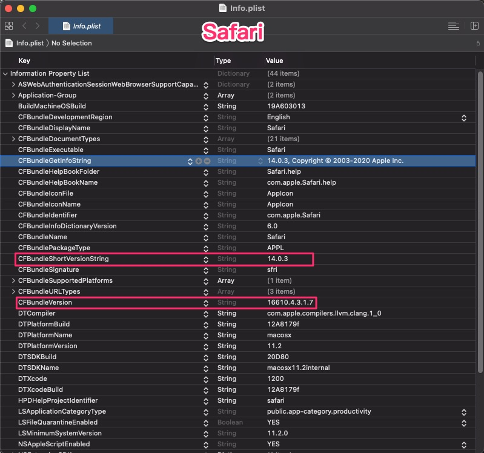
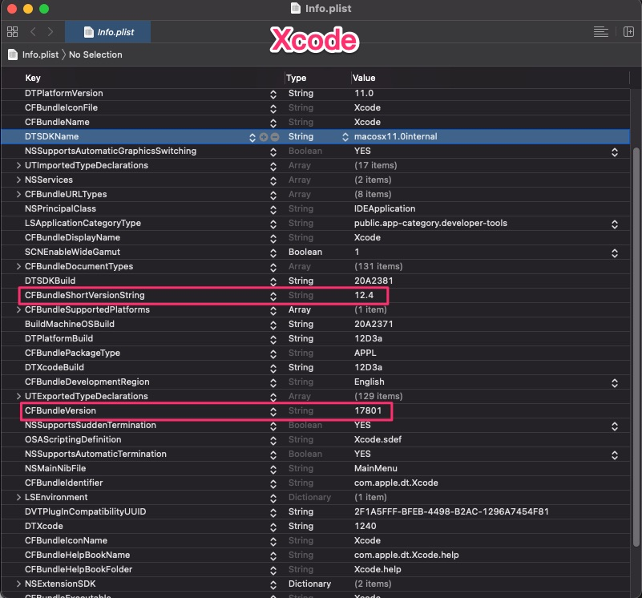
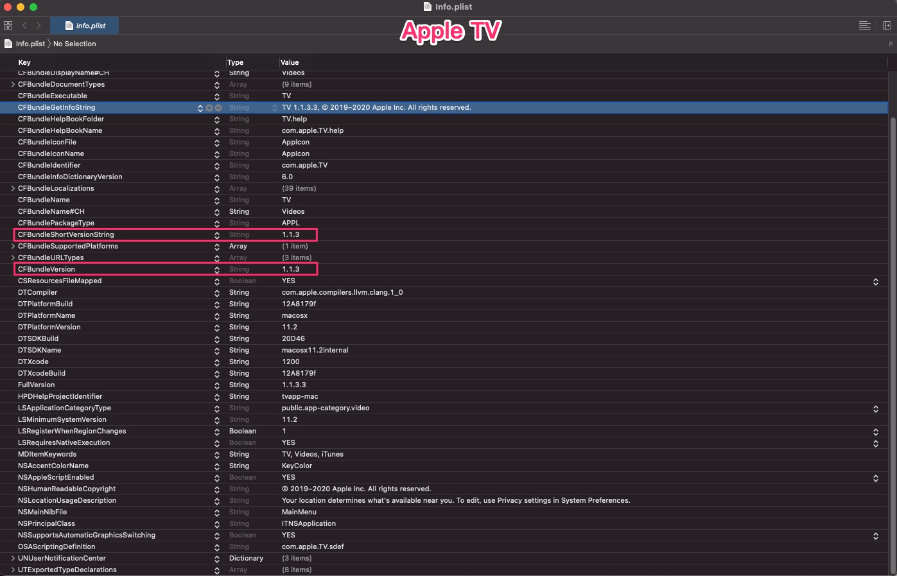
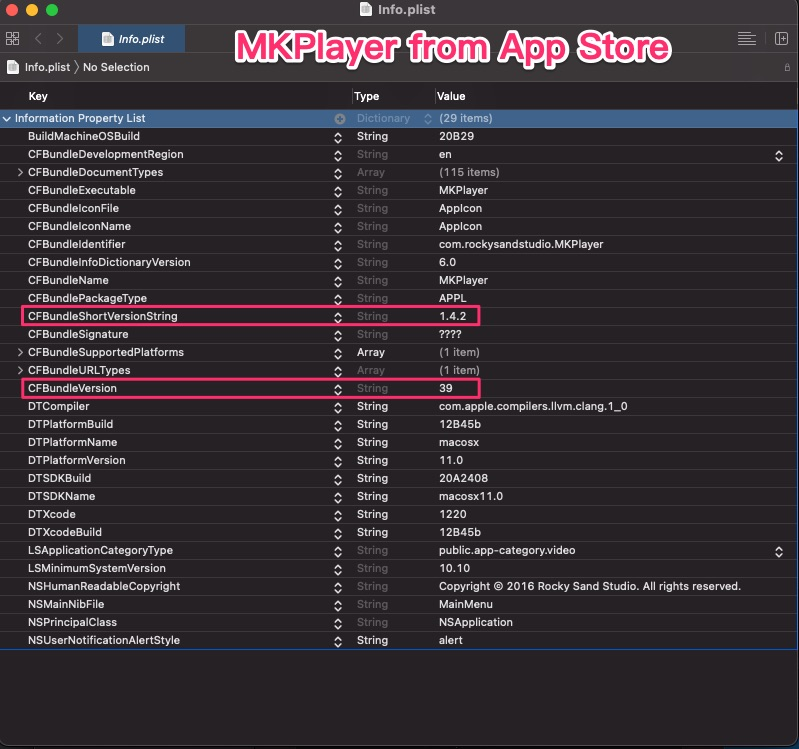

# Bundle Version

與 App 的 Version 有關的說明。

---
---

## 大綱

- [Bundle Version](#bundle-version)
  - [大綱](#大綱)
  - [說明](#說明)
    - [CFBundleVersion](#cfbundleversion)
    - [CFBundleShortVersionString](#cfbundleshortversionstring)
  - [App Store Connect](#app-store-connect)
  - [實際 App 案例](#實際-app-案例)
    - [Safari](#safari)
    - [Xcode](#xcode)
    - [AppleTV](#appletv)
    - [MKPlayer](#mkplayer)
  - [結論](#結論)
  - [參考](#參考)

---
---

## 說明

在 App 專案中，info.plist 有兩個與版本有關的 key，

分別為 CFBundleVersion 以及 CFBundleShortVersionString。

下面為說明此兩個 key 的作用。

---

### CFBundleVersion

- [官方說明][CFBundleVersion | Apple Developer Documentation]

  - 原文概述說明 :

    The version of the build that identifies an iteration of the bundle.

**說明 :**

- 為 info.plist (App Bundle 中的描述檔案) 中的一個系統定義好的 key。

  > 系統層級會去讀取的內容。

- 為建置識別碼 (build identifies)

  App Store 上用來識別 build 的 version，

  每次推送到 App Store Connect 時，

  需增量該內容，同樣的字串內容不可重複上傳。

- 機器識別用

- 編碼規則為 1~3 碼的整數組合，e.g. 10.14.1

- 字串只能有 `(0-9)`，`.` 的組合。

  > `數字`以及`小數點`的組合。

- 完整的三碼定義為 : [Major].[Minor].[Patch]

  - Major: A major revision number.

    > 主板號

  - Minor: A minor revision number.

    > 次板號

  - Patch: A maintenance release number.

    > 修補號 (補丁)

- 可允許只設定 1 或者 2 的整數。

  系統默認缺省的數字視為 0。

  - e.g. :

    CFBundleVersion : 10  => 10.0.0

  - e.g. :

    CFBundleVersion : 10.5  => 10.5.0

- 附註 :

  從經驗上，以及後來找尋的一些 App 案例，

  看起來是不會去修正 Bunlde 中的 info.plist 內容，

  所以上面說的默認解讀，應該不是自動補 0 修正內容，

  而是系統驗證時的規則吧。

  > 或許可以測試 推了一個 1.0 後，
  >
  > 若再推送一個 1.0.0 是否會被拒絕。

---

### CFBundleShortVersionString

- [官方說明][CFBundleShortVersionString | Apple Developer Documentation]

  - 原文概述說明 :

    The release or version number of the bundle.

**說明 :**

- info.plist (App Bundle 中的描述檔案) 中的一個系統定義好的 key。

  > 系統層級會去讀取的內容。

- 為發佈版本

  用來識別 Bundle Version。

- 給使用者看到的 bundle 版本資訊

  在 App Store 商城看到的版本資訊。

- 編碼規則 3 碼的整數組合，e.g. 10.14.1

- 字串只能有 `(0-9)`，`.` 的組合。

  > `數字`以及`小數點`的組合。

- 三碼定義為 : [Major].[Minor].[Patch]

  - Major: A major revision number.

    > 主板號

  - Minor: A minor revision number.

    > 次板號

  - Patch: A maintenance release number.

    > 修補號 (補丁)

---
---

## App Store Connect

接下來介紹這兩個 key 對應於 App Store Connect 上面的內容為何。

- App 資訊 - 1 (初始資訊):

  

- App 資訊 - 2 (新增建置版本):

  如圖，archive to app store connect 的 ipa 可於此選擇要送審的版本。

  

  > 多選一，同一個 CFBundleShortVersionString 可上傳不同的 CFBundleVersion 對應的 ipa。
  >
  > 可選擇其中一個 CFBundleVersion ipa 來送審。

- App 資訊 - 3 (選取建置版本後的結果):

  如圖：

  - CFBundleShortVersionString : 對應於`版本`。

  - CFBundleVersion : 對應於`建置版本`。

  

---
---

## 實際 App 案例

找尋了幾個 mac 上的 App 當案例。

### Safari

- Apple 官方 App

- info.plist

  

- CFBundleVersion : 16610.4.3.1.7 (5碼)

  > 安裝後的 info.plist 直接是 5 碼， 超過 3 碼是可以的。

- CFBundleShortVersionString : 14.0.3 (3碼)

---

### Xcode

- Apple 官方 App

- info.plist

  

- CFBundleVersion : 17801 (1碼)

  > 安裝後的 info.plist 直接是一碼，看來不會自動補 0 修正其 info.plist。

- CFBundleShortVersionString : 12.4 (2碼)

--—

### AppleTV

- Apple 官方 App

- info.plist

  

- CFBundleVersion : 1.1.3 (3碼)

- CFBundleShortVersionString : 1.1.3 (3碼)

- 附註 : 兩個一模一樣樣啊。

---

### MKPlayer

- 其他公司上架的 App

- info.plist

  

- CFBundleVersion : 39 (1碼)

- CFBundleShortVersionString : 1.4.2 (3碼)

---
---

## 結論

- [0~9][.] 組合

  [xxx.xxx.xxx] : 中間的數量看來無限制，並不一定要 3 碼。

  連 App 官方都沒有統一遵循 [Major].[Minor].[Patch] 此規則，
  
  應該還是取決於團隊對該 App 的版本想法。

- CFBundleVersion 與 CFBundleShortVersion 不一定要有相關性

- App Store Connect 上的對應

  - CFBundleVersion : 建置版本

     > 系統比對
     >
     > 同一個建置版本，不可 archive to app store connect

  - CFBundleShortVersion : 版本

    > 主要是給人看的，但也是此次送審的版本資訊
    >
    > 真正商城的版本 (顯示給一般使用者看的版本)

---
---

## 參考

- [CFBundleShortVersionString | Apple Developer Documentation]

- [CFBundleVersion | Apple Developer Documentation]

- [iOS App 版本的定义 - 简书]

<!-- 連結設定 -->

[CFBundleShortVersionString | Apple Developer Documentation]: https://developer.apple.com/documentation/bundleresources/information_property_list/cfbundleshortversionstring

[CFBundleVersion | Apple Developer Documentation]: https://developer.apple.com/documentation/bundleresources/information_property_list/cfbundleversion/

[iOS App 版本的定义 - 简书]: https://www.jianshu.com/p/0893c570fce0

---

[=> Top](#bundle-version)

[=> Go Back](../README.md)
