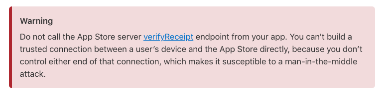
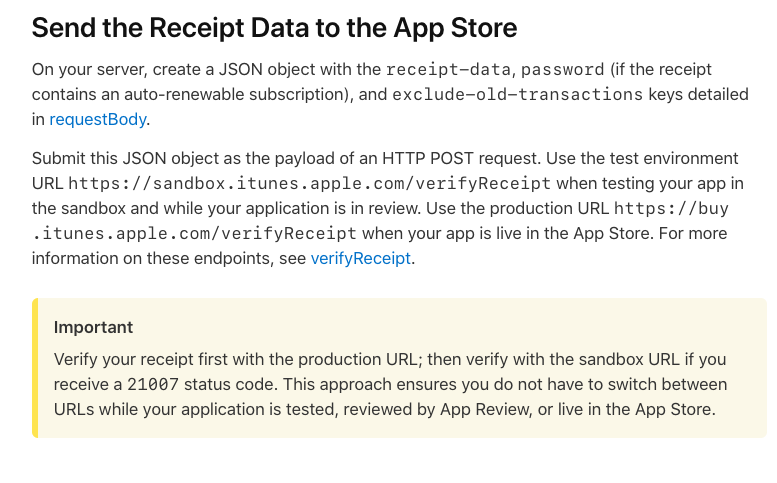

# Validating Receipts

IAP 的驗證收據的說明，以官方文件為主，列出一些重點摘要。

---

## 大綱

- [Validating Receipts](#validating-receipts)
  - [大綱](#大綱)
  - [說明](#說明)
  - [參考](#參考)

---

## 說明

- 撰寫時間 : 2021-05-12

- [官方文件][Validating Receipts with the App Store | Apple Developer Documentation]

**重點摘要 :**

- 不可由客端來做收據驗證

  主要原因為不清楚客端的環境，有可能會有中間人攻擊的極大風險。

  

- Send the Receipt Data to the App Store

  

  Apple Store 的驗證收據 Server。

  有兩個環境的 Apple Store 驗證收據的 webapi 服務。

  - [environment URL](https://sandbox.itunes.apple.com/)

    Sandbox 以及 In Review 階段的驗證收據服務。

  - [production URL](https://buy.itunes.apple.com/verifyReceipt)

    正式 (production) 環境 (從 App Store 下載下來的 App) 所購買的 IAP 收據驗證服務。

  - Important :

    官方說明應該使用先驗證 production URL，

    解開來收到 status code : 21007，表示為 Sanbox 的收據，

    此時再透過 Sanbox URL 來解開收據內容，

    使其不需要切換 URL 的方式，可同時在 test 階段，inReview 階段，

    或者是 live 階段都可正常運行。

---

## 參考

- [Validating Receipts with the App Store | Apple Developer Documentation]

  > 官方 Guideline，驗證收據。

<!-- 連結設定 -->

[Validating Receipts with the App Store | Apple Developer Documentation]: https://developer.apple.com/documentation/storekit/in-app_purchase/validating_receipts_with_the_app_store

---

[=> Top](#validating-receipts)

[=> Go Back](../README.md)
