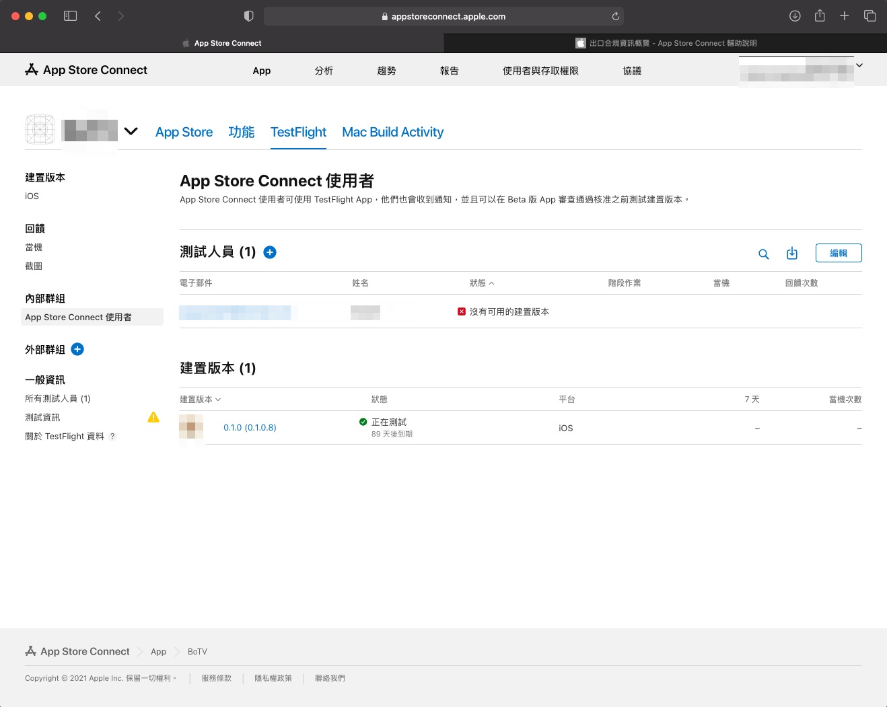

# 出口合規 Issue

在 iOS 送審過程，archive To App Store Connect 時，

出現 `出口合規` 的相關提示錯誤，需要手動處理。

---
---

## 大綱

- [出口合規 Issue](#出口合規-issue)
  - [大綱](#大綱)
  - [說明](#說明)
    - [App Store Connect 手動去除出口合規警告](#app-store-connect-手動去除出口合規警告)
    - [出口合規](#出口合規)
  - [延伸議題](#延伸議題)
    - [自動提供 缺少出口合規資訊](#自動提供-缺少出口合規資訊)
  - [參考](#參考)

---
---

## 說明

### App Store Connect 手動去除出口合規警告

- 01 - 缺少出口合規資訊 (@ App Store Connect)

  app archive 到 App Store Connect 後，

  可於建置版本上面，發現有出現警告提示。

  > 缺少出口合規資訊，所以測試人員也無法選擇該版本進行 Test Flight 測試。
  >
  > 可到這邊 [出口合規](#出口合規) 了解用途。

  

- 02 - 手動處理

   點擊可以手動處理該項目。

  

- 03 - 點選否

  使用的加密都是公開的演算法，沒有違反美國的出口合規。

  

- 04 - 出口合規 警告消失。

  不過上面測試人員還是不能選版本，有可能是網頁更新問題。

  

- 05 - 網頁 Refresh

  網頁重新整理後，測試人員狀態就正常了，可以選該版本進行測試。

  

---

### 出口合規

手動解除了出口合規，此版本才能使用，

那什麼是出口合規呢？

- 內文來自官網文章 - [出口合規資訊概覽 - App Store Connect 輔助說明]。

  

- 加密的使用包含（但不限於）下列事項：

  - 透過安全頻道（即 HTTPS、SSL 等）所進行的呼叫。

  - 使用標準的加密演算法。

  - 使用其他來源（如 iOS 或 macOS）的密碼技術功能。

  - 使用專利或非標準的加密演算法。美國政府將「非標準密碼技術」定義為：任何涉及了整合（或使用）專利或未發布之密碼技術功能的「密碼技術」實作，包括未經公認之國際標準機構（例如 IEEE、IETF、ISO、ITU、ETSI、3GPP、TIA 和 GSMA）採用或核准，且尚未對外發布的加密演算法或通訊協定。

基本上沒有超出上面使用範圍的 App，則可以不用交付出口合規證明文件。

---
---

## 延伸議題

### 自動提供 缺少出口合規資訊

那如何在 Archive To App Store Connect 時，

自動提供 `缺少出口合規資訊` 呢 ?

這樣就可以減少手動的步驟。

有興趣的可參考 [自動提供 缺少出口合規資訊]。

---
---

## 參考

- [出口合規資訊概覽 - App Store Connect 輔助說明]

- [APP TestFlight缺少出口合規資訊. (APP, 出口合規資訊, Export compliance… | by Peggy Tsai  | 彼得潘的 Swift iOS App 開發教室 | Medium]

- [自動提供 缺少出口合規資訊]

  > iOS 專案 info.plist 設定方式，可以說明不需要 `出口合規` 文件。

---

<!-- 連結設定 -->

[出口合規資訊概覽 - App Store Connect 輔助說明]: https://help.apple.com/app-store-connect/#/dev88f5c7bf9

[APP TestFlight缺少出口合規資訊. (APP, 出口合規資訊, Export compliance… | by Peggy Tsai  | 彼得潘的 Swift iOS App 開發教室 | Medium]: https://medium.com/%E5%BD%BC%E5%BE%97%E6%BD%98%E7%9A%84-swift-ios-app-%E9%96%8B%E7%99%BC%E6%95%99%E5%AE%A4/app-%E7%BC%BA%E5%B0%91%E5%87%BA%E5%8F%A3%E5%90%88%E8%A6%8F%E8%B3%87%E8%A8%8A-64e3e7f2b55f

[自動提供 缺少出口合規資訊]: https://github.com/espgrandia/Xcode.Journey/blob/master/Provided_Automatically_Export_Compliance/

[=> Top](#出口合規-issue)

[=> Go Back](../README.md)
