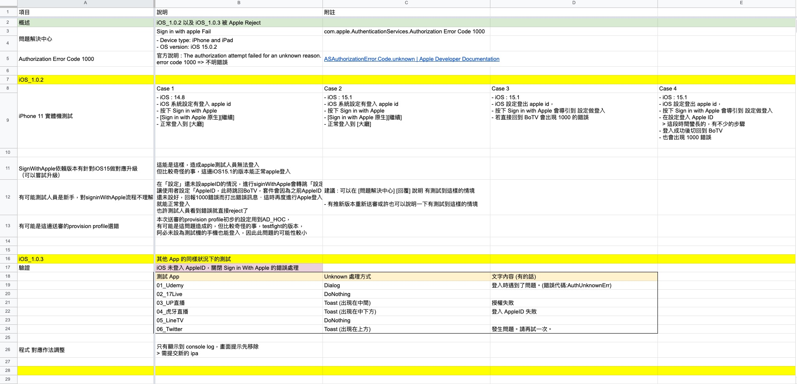

# Sign In With Apple Reject For 2.1

---

## 大綱

- [Sign In With Apple Reject For 2.1](#sign-in-with-apple-reject-for-21)
  - [大綱](#大綱)
  - [概要](#概要)
  - [項目](#項目)
  - [問題說明](#問題說明)
  - [結論](#結論)
  - [參考](#參考)

---

## 概要

之前某產品遇到連續兩個版本被同一個設計條款拒絕。

> `2.` 1 Performance: App Completeness

這邊節錄原文以及當時的 其他 App 參考 。

---

## 項目

- [ResolutionCenter 原文 For Sign In With Apple]

  > 當時的 Apple 的原文。

- [問題說明](#問題說明)

- [SignInWithApple_Test_At_UnloginAppleID_In_iOS_Setting]

  其他 App 同樣狀況下的測試。

---

## 問題說明

會出現這個錯誤訊息，我們有測出出現錯誤訊息的再現方式。

- iOS 系統設定沒有登入 Apple ID

- 按下 Sign in with Apple 會導引到 設定做登入

  - 若直接回到 App 會出現 此的錯誤。

  - 此時在 iOS 系統設定中登入 Apple ID，再回到 App 也會看到該錯誤訊息。

- 當時的測試以及想法

  

---

## 結論

第一次遇到問題是有調整文字內容過關，第二次又出現，

後來是先採用 只顯示到 console log，畫面提示先移除。

之後再看是否要優化，改為 Toast。

> 官方文件看起來沒有標準的做法，感覺這個跟審核人員的心證有很大的關聯。

---
---

## 參考

- [ResolutionCenter 原文 For Sign In With Apple]

  > `2.` 1 Performance: App Completeness

- [ios - Binary rejected because of missing username and password for test account in Test information TestFlight - Stack Overflow]

  > 與 Guideline 2.1 - Information Needed 有關的討論文章。

- [ASAuthorizationAppleIDProviderCredentialState | Apple Developer Documentation]

- [Guideline 2.1-Performance-App Completeness]

- [Guideline 2.1-Information Needed]

- [SignInWithApple_Test_At_UnloginAppleID_In_iOS_Setting]

  > iOS 系統未登入 AppleID，關閉 Sign in With Apple 的錯誤處理 (for 測試其他 App 的處理狀況)。

---
---

<!-- 連結設定 -->

[ResolutionCenter 原文 For Sign In With Apple]:
  ./ResolutionCenter/README.md

[ios - Binary rejected because of missing username and password for test account in Test information TestFlight - Stack Overflow]:
  https://stackoverflow.com/questions/63107523/binary-rejected-because-of-missing-username-and-password-for-test-account-in-tes

[ASAuthorizationAppleIDProviderCredentialState | Apple Developer Documentation]:
  https://developer.apple.com/documentation/authenticationservices/asauthorizationappleidprovidercredentialstate?language=objc

[Guideline 2.1-Performance-App Completeness]:
  ./ResolutionCenter/README.md#guideline-21-performance-app-completeness

[Guideline 2.1-Information Needed]:
  ./ResolutionCenter/README.md#guideline-21-information-needed

[SignInWithApple_Test_At_UnloginAppleID_In_iOS_Setting]:
  ./SignInWithApple_Test_At_UnloginAppleID_In_iOS_Setting/README.md

---
---

[=> Top](#sign-in-with-apple-reject-for-21)

[=> Go Back](../README.md)
