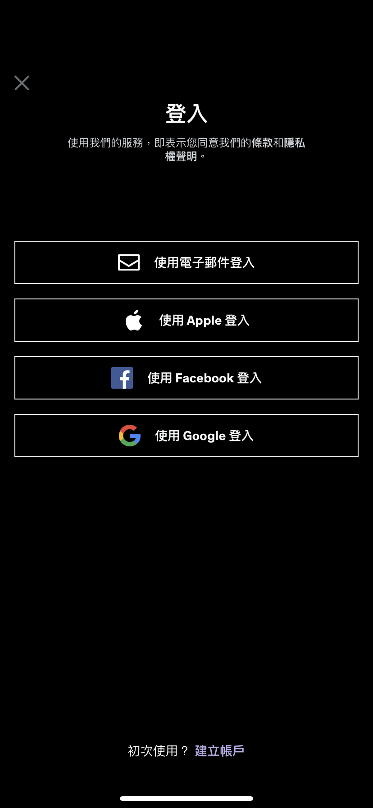

# Sign In With Apple Test(for 在 iOS 系統未登入 AppleID)

---
---

## 大綱

- [Sign In With Apple Test(for 在 iOS 系統未登入 AppleID)](#sign-in-with-apple-testfor-在-ios-系統未登入-appleid)
  - [大綱](#大綱)
  - [說明](#說明)
  - [測試紀錄](#測試紀錄)
    - [01_Udemy](#01_udemy)
    - [02_17Live](#02_17live)
    - [03_UP直播](#03_up直播)
    - [04_虎牙直播](#04_虎牙直播)
    - [05_LineTV](#05_linetv)
    - [06_Twitter](#06_twitter)

---
---

## 說明

- 主題 : iOS 系統未登入 AppleID，關閉 Sign in With Apple 的錯誤處理 (for 測試其他 App 的處理狀況)

- 測試時間 : 2021-11-19

- 測試方式 :

  - 測試關閉

  - 測試 前往 [設定] ，未執行登入再切回到 App

- 結果

  | 測試 App     | Unknown 處理方式    | 文字內容 (有的話)                     |
  |------------|-----------------|--------------------------------|
  | 01_Udemy   | Dialog          | 登入時遇到了問題。(錯誤代碼:AuthUnknownErr) |
  | 02_17Live  | DoNothing       |                                |
  | 03_UP直播    | Toast (出現在中間)   | 授權失敗                           |
  | 04_虎牙直播    | Toast (出現在中下方)  | 登入 AppleID 失敗                  |
  | 05_LineTV  | DoNothing       |                                |
  | 06_Twitter | Toast (出現在上方) | 發生問題。請再試一次。                    |

- 分析

  有六個 App，主要三種處理方式

  - Dialog : 1 個

  - DoNothing : 2 個

    > 畫面不處理

  - Toast : 3 個

- 目前被拒絕的做法分析

  被拒絕的畫面表現為 Dialog 處理方式。

  六個中只有一個。

  - 不處理兩個，剛剛上傳的版本。

  - 最多的是 Toast 作法。

    > 這個討論時有提到的優化方案。

- 結論 :

  先暫時使用 DoNothing 方式，送審看看，之後再看是否要優化，改為 Toast。

  > 官方文件看起來沒有標準的做法，感覺這個跟審核人員的心證有很大的關聯。

---
---

## 測試紀錄

---

### 01_Udemy

**步驟 :**

- 01_Home_Login

  

- 02_SignInWithApple

  

- 03_SignInWithApple_Click

  

- 04_SignInWithApple_UnknownError_Dialog

  

**測試影片 :**

- [測試影片](./01_Udemy/RPReplay_Final1637302879_480p.mov)

---

### 02_17Live

**步驟 :**

- 01_SignInWithApple

  

- 02_SignInWithApple_Click

  

- 03_SignInWithApple_UnknownError_DoNothing

  

**測試影片 :**

- [測試影片](./02_17Live/RPReplay_Final1637302932_480p.mov)

---

### 03_UP直播

**步驟 :**

- 01_SignInWithApple

  

- 02_SignInWithApple_Click

  

- 03_SignInWithApple_UnknownError_Toast

  

**測試影片 :**

- [測試影片](./03_UP直播/RPReplay_Final1637303104_480p.mov)

---

### 04_虎牙直播

**步驟 :**

- 01_Home

  

- 02_MineSetting

  

- 03_SignInWithApple_Click

  

- 04_SignInWithApple_PrivatePolicy_Agree

  

- 05_SignInWithApple

  

- 06_SignInWithApple_Click

  

- 07_SignInWithApple_UnknownError_Toast

  

**測試影片 :**

- [測試影片](./04_虎牙直播/RPReplay_Final1637303305_480p.mov)

---

### 05_LineTV

**步驟 :**

- 01_Home

  

- 02_Persional

  

- 03_Register_Or_Login

  

- 04_Login

  

- 05_SignInWithApple_Click

  

- 06_SignInWithApple_UnknownError_DoNothing

  

**測試影片 :**

- [測試影片](./05_LineTV/RPReplay_Final1637303370_480p.mov)

---

### 06_Twitter

**步驟 :**

- 01_SignInWithApple

  

- 02_SignInWithApple_Click

  

- 03_SignInWithApple_UnknownError_Toast

  

**測試影片 :**

- [測試影片](./06_Twitter/RPReplay_Final1637303765_480p.mov)

---
---

[=> Top](#sign-in-with-apple-testfor-在-ios-系統未登入-appleid)

[=> Go Back](../README.md)
